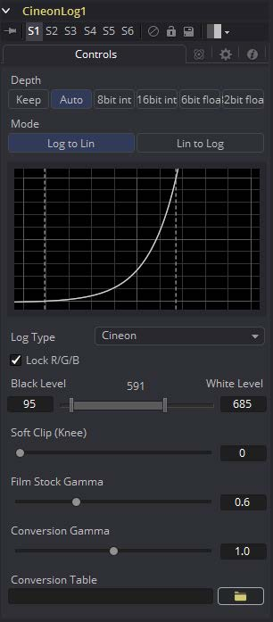
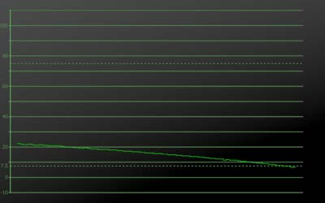

### Cineon Log [Log]

Cineon Log工具用于将图像数据从对数转换为线性。该工具用于若在Cineon Loader中绕过了log-lin转换来将处理返回到Linear。

#### Controls 控件

##### Mode 模式

这些按钮提供两个选项，一个用于将对数图像转换为线性，另一个用于将线性图像转换为对数。

##### Lock RGB 锁定RGB

选中后，此选项卡中的设置将同样影响所有颜色通道。取消选中此控件可使用每个通道的单独设置来转换图像的Red、Green和Blue通道。

##### Black Level and White Level 黑色等级和白色等级

使用此控件可以在转换之前在对数图像中设置黑点和白点。对数空间中的值低于Black Level的像素将超出0.0以下的范围值。转换后值高于White Level的像素将超出1.0以上的范围值。

在浮点颜色空间中进行处理时，通过转换保留以Cineon格式存储的超出范围的值。在16位或8位模式下，超出范围的值将被裁剪。

##### Soft Clip (Knee) 软裁剪（）

Soft Clip控件用于将超出范围的值重新绘制到图像中。这可以通过平滑转换曲线顶部和底部的转换曲线来完成，以表示更多的值。

应用非1的任何值的软裁剪将立即使该工具以16位整数进行处理，从而去除了所有不适合该软裁剪的超出范围的值。

##### Film Stock Gamma, Conversion Gamma and Conversion Table 电影胶片伽玛、转换伽玛和转换表

这些控件用于设置转换期间对数数据的响应曲线。除了上述设置之外，还可以使用特定的转换值来创建自定义ASCII文件查找表（Look Up Table，LUT）。 可以使用文件夹图标（File Folder Icon）按钮加载ASCII LUT文件。

##### Black Rolloff 黑色滚降

由于对值为零或更低的进行数学log()运算将导致无效值，因此Fusion会将低于1e-38（0后跟38个零）的值裁剪为0以确保结果正确。这几乎从来都不会有问题，因为很小的值对图像没有视觉影响。要查看如此微小的值，你也必须添加三个Brightness Contrast工具，且每个工具的增益设置为1,000,000。即使如此，这些值也将徘徊在非常接近零的位置。

我们已经看到了一些它们不会缩放这些非常小的值，而是被缩放的过程。因此，将介于0.0和1e-16之间的值缩放为介于1e-18和1e-16之间。这一想法是将浮点图像中的大部分可视范围分散为非常接近零的值，然后再次对其进行扩展，来强制使用平缓的渐变生成极黑值的较小渐变。如果您使用该过程来面对色彩管线，则可以使用自定义工具来模拟它。

该过程涉及将对数图像转换为具有非常小的伽玛值和比正常黑色等级到白色等级还宽的线性图像。（例如，转换伽马为0.6，黑色为10，白色为1010），这会将大部分图像范围压缩为非常小的值。接下来是自定义工具（如下所述），然后是线性到对数转换，该过程相反，但是使用了稍高的黑色等级。黑色等级之间的差异定义了衰减范围。

由于这会消除黑点，因此通常会使用更多传统的值（即95-685）来重置黑点，然后再将图像转换回线性一次。

自定义工具应在Red、Green和Blue表达式中使用以下等式：

`if (c1< 1e-16, 1e-18 + (c1/1e-16)*(1e-16 - 1e-18), c1)`

##### Falloff Comparison 衰减比较

本地Fusion处理的衰减

削波处理的衰减