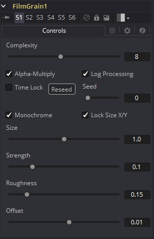
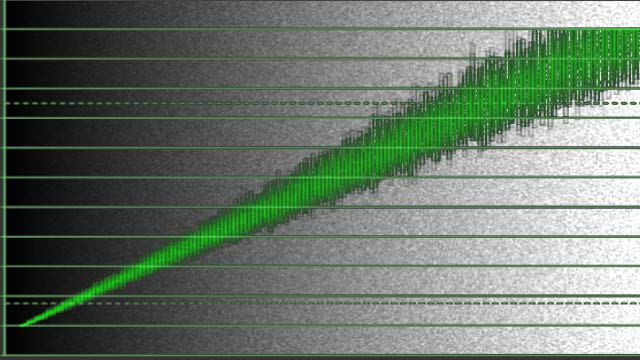
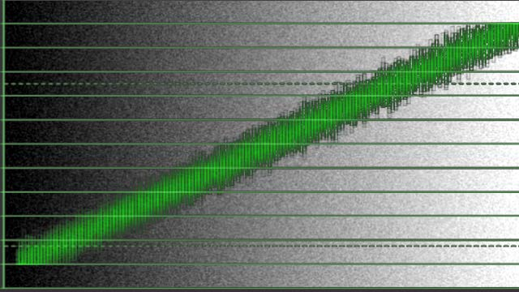

### Film Grain [FGr]

Film Grain工具采用了一种新的颗粒处理方法，这种方法应与现代胶片库存的颗粒轮廓更紧密地对齐。这样可以更好地控制颗粒的最终外观。

> **注意：**Film Grain工具不能代替原始Grain工具，Grain工具仍然可以用来加载和渲染较早的合成，但是现在几乎在每种情况下都鼓励使用新的Film Grain工具。

#### Controls 控件

##### Complexity 复杂度

颗粒的复杂度表明了应用于图像的颗粒“层数”。复杂度为1时仅计算一个颗粒层并将其应用于图像。复杂度设置为4时，该工具将计算四个单独的颗粒层，并将每次通过的平均合并结果应用于最终图像。较高的复杂度会在视觉上产生更复杂的结果，而通常不会在数字产生的颗粒中看到明显的规律性。

##### Alpha Multiply Alpha乘

启用Alpha Multiply复选框后，Film Grain工具会将其结果乘以源图像的Alpha通道。这在处理后乘图像时是必要的，这样来确保颗粒不会影响alpha为0.0（透明）的图像区域。

> **注意：**由于在与背景合成之前很难确定图像中的半透明像素的最终值，所以应避免对元素进行对数处理后再对它们进行合成。这将确保颗粒的强度是准确的。

##### Log Processing 对数处理

启用此复选框（默认）后，应用于图像的颗粒将非线性地应用其强度，以匹配大多数胶片的颗粒轮廓。粗略地讲，颗粒的强度将从黑色到白色成指数增长。禁用此复选框时，无论受影响像素的亮度如何，都将均匀应用颗粒。

胶片中颗粒的主要特征之一是，颗粒的外观会随着曝光而发生根本变化，因此黑色中似乎很少出现颗粒，并且随着像素曝光量的增加，颗粒的数量和偏差也会增加。在胶卷底片中，显影图像的最暗部分将显得完全不透明，从而使颗粒模糊。随着底片变得越来越清晰，结果中会出现更多的颗粒。膜的Red、Green和Blue层对光的响应中的化学差异也会导致膜的每种色彩成分呈现出不同的颗粒轮廓，通常Blue通道呈现出最大量的颗粒。

因此，新的Film Grain工具中最重要的控件是Log Processing复选框，在匹配胶片时应启用该复选框，而在处理需要更线性颗粒响应的图像时应禁用该复选框。启用此复选框将紧密模拟在旧的Grain工具之前执行Linear > Log转换，然后紧随其后的Log > Linear转换的结果。

##### Seed 种子

每当Fusion工具依赖随机结果时，都会显示Seed滑块和Randomize按钮。具有相同种子值的两个工具将产生相同的随机结果。单击Randomize按钮以随机选择一个新的种子值，或调整滑块以手动选择一个新的种子值。

##### Monochrome 单色

启用Monochrome复选框（默认）后，颗粒将平均应用于图像的Red、Green和Blue通道。如果取消选择，则可以分别控制每个通道中颗粒的大小、强度和粗糙度。

##### Lock Size X/Y 锁定尺寸X/Y

取消选择Lock Size X/Y复选框，来分别控制X和Y轴上的颗粒大小。

##### Size 尺寸

颗粒尺寸是相对于像素尺寸计算的，因此更改图像的分辨率不会影响颗粒的相对外观。默认的Grain Size为1.0将产生覆盖约2个像素的颗粒内核。

##### Strength 强度

颗粒表示为与像素原始颜色的差异。颗粒的强度越强，与原始像素值的可能变化就越大。例如，给定一个像素，其原始值为p，而颗粒工具的c`omplexity=1 size=1; roughness=0; log processing=off;` 颗粒将产生p +/-强度的输出值。换句话说，值为0.5的像素拥有颗粒强度0.02可能会达到0.48到0.52之间的最终值。

再一次，这有点过分简化了，特别是当复杂度超过1时。启用Log Processing复选框也会导致变化受到影响，从而使黑色的变化更少，而白色的变化更大。

> **注意：**当可视化颗粒在图像上的效果时，数学上越倾斜可能会发现它更像是在描绘正弦波，其中当Grain Size为1.0时，正弦波的每个波瓣都覆盖1个像素。Grain Size控制正弦波的频率，而Grain Strength控制其振幅。同样，这有点过分简化了。

##### Roughness 粗糙度

Roughness滑块应用低频变化，给人产生颗粒结实的印象。尝试将Roughness设置为0，您会发现所生成的颗粒在整个图像上的亮度变化非常均匀。将Roughness增加到1.0，您将观察到亮度变化中存在“细胞化的”差异。

##### Offset 偏移

Offset控件通过在计算颗粒的强度之前对值进行补偿来帮助匹配深黑中谷物的强度。因此，Offset为0.1会使值0.1的像素接收颗粒，就好像其值实际上就是0.2一样。

#### Processing Examples 处理示例

##### Log Processing On 对数处理开启

在默认设置中，将不同量的Grain应用于图像的黑色和白色。

##### Log Processing Off 对数处理关闭

