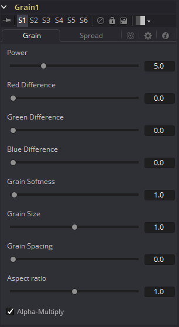
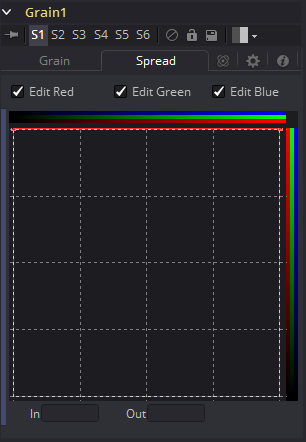
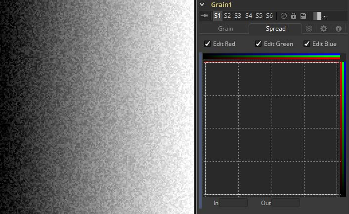
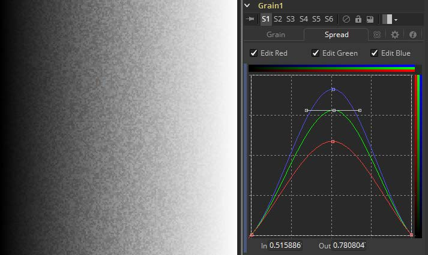

### Grain [Grn]

Grain工具提供了全面的胶片颗粒仿真功能。这对于将模拟颗粒引入视频或计算机生成的图像并匹配给定场景中的现有颗粒很有用。

#### Grain Tab 颗粒选项卡

##### Power 力度

此滑块确定颗粒的强度。较高的值会增加可见性，使颗粒更普遍。

##### RGB Difference RGB差异

单独的Red、Green和Blue滑块用于在每个通道的基础上修改效果的强度。

##### Grain Softness 颗粒柔度

此滑块控制颗粒的模糊度。较小的值会导致颗粒更尖锐或粗糙。

##### Grain Size 颗粒尺寸

该滑块确定颗粒的尺寸。较高的值会增加颗粒尺寸。

##### Grain Spacing 颗粒间距

此滑块确定单位面积上颗粒的密度或数量。较高的值会导致颗粒看起来间隔更大。

##### Aspect Ratio 宽高比率

该滑块可调整颗粒的外观，以便可以与变形的像匹配。

##### Alpha-Multiply Alpha乘

启用后，此复选框会将图像乘以Alpha，来清除黑色区域的所有颗粒效果。

#### Spread Tab 分布选项卡

##### Edit RGB Checkboxes 编辑RGB复选框

分开使用Red、Green和Blue可启用每个通道的自定义曲线。Blue通道中出现的颗粒比Red通道中出现的多，而Green通道接收的颗粒最少。该曲线模仿了通常的胶片响应。右键单击样条曲线区域将显示一个上下文菜单，其中包含与修改样条曲线相关的选项。有关LUT编辑器控件及其选项的完整说明，请参见本手册的工具控件（Tool Controls）一章。

##### In and Out 入和出

通过设置In/Out点值，该控件可以直接编辑曲线上的点。

#### Spread Examples 散布区域

##### Default Spread 默认散布

在默认设置下，如此处所示，Grain被均匀地应用于整个图像。但是，胶卷通常会在黑、中和白中显示出不同数量的颗粒。

##### Bell-Shaped Spread 钟形散布

设置钟形通常更有利于创建更逼真的外观。此处我们在Red、Green和Blue通道中也具有不均匀的分布，具有不同数量的颗粒。

在两个示例中，颗粒的强度都被夸大了，使显示效果更明显。