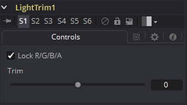

### Light Trim [LT] 光线修整

此工具模拟胶片扫描仪的光线修整。根据它的设计，此工具最适合对数数据，例如Cineon文件系统存储的图像。提供对数数据时，可以使用Light Trim工具来增加或减少图像的表观曝光度。

#### Controls 控件

##### Lock RGBA 锁定RGBA

选中后，Lock RGBA控件会将所有图像通道的控制折叠到一个滑块中。默认情况下，此选择处于启用状态。要独立操作各种颜色通道，请取消选中此复选框。

##### Trim 修整

该滑块可移动胶片、光学印刷和实验室印刷点的颜色。8点等于一站式曝光。