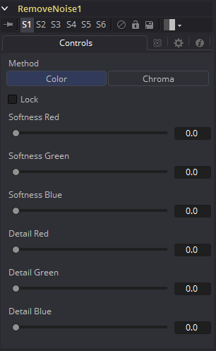
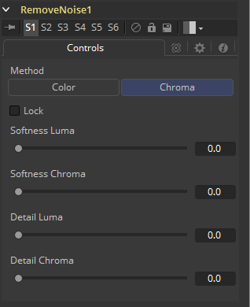

### Remove Noise [RN] 移除噪声

Remove Noise工具提供了简单的噪声管理。其操作的基本原理是该工具对图像通道进行模糊处理，然后将模糊的图像与原始图像进行比较以提取噪声。然后将锐度应用于图像，除非检测到噪点。

要使用此工具，查看图像并观看Red通道。然后增加Red Softness，直到颗粒消失。接下来增加锐度直到细节再次出现，但在颗粒再次出现之前停止。对Green和Blue通道重复上述步骤。

#### Controls / Color 控件/色彩

##### Method 方法

使用这些按钮选择工具是使用Color还是Chroma方法处理颜色。这也将为您提供一组不同的控件滑块。

##### Lock 锁定

此复选框会将每个通道的Softness和Detail滑块链接在一起。

##### Softness Red, Green and Blue 柔度Red、Green和Blue

Softness滑块确定应用于图像每个通道的模糊量。在Chroma模式下，分别有Luminance和Chrominance通道中的柔和度滑块。

##### Detail Red, Green and Blue 细节Red、Green和Blue

Sharpness滑块确定在柔化每个通道后将多少细节重新引入每个通道。在Chroma模式下，分别有用于Luminance和Chrominance通道的滑块。

#### Controls / Chroma 控件/色度

##### Method 方法

与RGB控件使用相同的原理，但是在这种情况下，Luminance和Chrominance通道会受到影响。