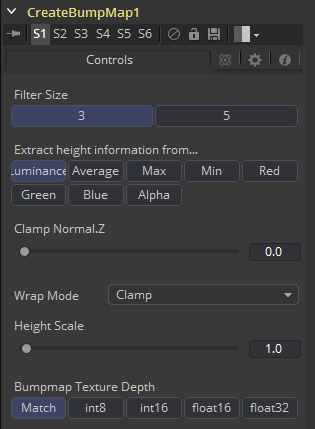

### CreateBumpmap [CBu]

Create Bumpmap工具可将灰阶（高度图）图像转换为凹凸贴图。查看说明中有关Fusion中使用的命名约定的信息。由于生成的凹凸矢量信息表示为RGB，因此可以使用Fusion中的所有图像处理工具对其进行修改。使用Create Bumpmap工具将其应用于材质。

#### External Input 外部输入

**CreateBumpmap.ImageInput**

[白色，必需的]从图像输出接收RGBA通道以进行凹凸计算。

#### Controls 控件

##### Filter Size 滤镜尺寸

生成凹凸信息的过程基本上是一个Custom Filter。 此多按钮控件可设置滤镜尺寸。

##### Extract height information from... 从…中解压高度信息

设置从中提取灰阶信息的通道。

##### Clamp Normal.Z 夹Normal.Z

在生成的凹凸纹理中裁剪Blue通道的较低值。

##### Filter Wrap Mode 滤镜包装模式

基本上将图像包装在边界处，因此当使用无缝可平铺纹理时，滤镜会产生正确的结果。

##### Height Scale 高度缩放

更改凹凸贴图中结果值的对比度。增大此值将产生更明显的凹凸贴图。

##### Bumpmap Texture Depth 凹凸纹理材质深度

可选地将生成的凹凸纹理转换为所需的位深度。

#### Notes on Bumpmaps 关于凹凸贴图的注释

##### Heightmap 高度贴图

包含每个像素的高度值的灰阶图像。

##### Bumpmap 凹凸贴图

包含存储在用于修改现有法线的RGB通道中的法线的图像（通常在切线空间中给出）。

##### Normalmap 法线贴图

包含存储在用于替换现有法线的RGB通道中的法线的图像（通常在切线或物体空间中给出）