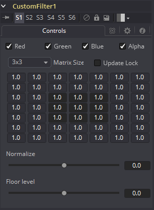

### Custom Filter [CFlt] 自定义滤镜

Custom Filter工具用于将自定义卷积滤镜应用于图像。自定义卷积滤镜可以提供各种图像效果。例如，压纹、浮雕、锐化、模糊和边缘检测都是卷积滤镜。可以通过右键单击控件标题并从上下文菜单中选择Settings > Load来加载Filter目录中提供的许多自定义滤镜。

内核滤镜是3×3、5×5或7×7值的数组（或网格）。数组的中心表示当前像素，而邻近的项表示相邻像素。值为1会将像素的整个值应用于滤镜。值为0会忽略像素的值。大于1的值乘以像素对结果的影响。也可以输入负值，其中将从平均值中减去像素值。只能输入整数值；0.5是无效的。

例如，一个具有以下值的滤镜…

`0 0 0`
`0 1 0`
`0 0 0`

…将不会对其相邻像素产生影响，并且生成的图像将保持不变。而模糊效果将是…

`1 1 1`
`1 1 1`
`1 1 1`

…将相邻像素与中心平均，从而获得柔化效果。

`-5 0 0`
`0 1 0`
`0 0 5`

本示例将从左上角减去五倍，然后从右下角减去五倍。如果处理的图像部分的颜色非常平滑，则相邻的值将非常相似。在像素不同的图像部分（即边缘）中，结果将有所不同，并倾向于突出或压印图像中的边缘。

在滤镜中使用这些值…

`1 1 1`
`1 1 1`
`1 1 1`

...并将Normalize设置为Positive将使图像变亮或发光，从而模拟胶片过度曝光。

在滤镜中使用这些值…

`-1 0 0`
`0 0 0`
`0 0 0`

...并将Floor Level滑动到Positive，这将类似于Relief滤镜。

#### Controls 控件

##### Color Channels (RGBA) 色彩通道（RGBA）

颜色校正器默认在R、G、B和A通道上运行。通过单击每个通道旁边的复选框，可以选择通道进行编辑，以使选定的通道处于活动状态或非活动状态。

这与通用控件下的RGBA复选框不同。该工具在处理之前会考虑这些控件。取消选择通道将导致工具在处理时跳过该通道，从而加快效果的渲染速度。相比之下，Common Controls选项卡下的这些控件在处理工具后应用。

##### Matrix Size 矩阵尺寸

使用此下拉列表可以将滤镜的大小设置为3×3像素、5×5像素或7×7像素，从而设置采样像素的半径。尺寸越大，渲染所需的时间越多。

##### Update Lock 更新锁定

选择此控件后，Fusion将不会渲染滤镜。这对设置滤镜的每个值，然后关闭Update Lock并渲染滤镜有帮助。

##### Filter Matrix 滤镜矩阵

Filter Matrix控件是一个7×7的文本框网格，在其中输入数字表示每个像素对整体卷积滤镜有多大影响。中间的文本框表示由滤镜处理的像素。中心左侧的文本框表示紧靠左侧的像素，依此类推。

默认的矩阵大小为3×3。仅分析与当前像素紧邻的像素。如果设置了较大的矩阵大小，则将启用网格中更多的文本框以供输入。

##### Normalize 归一化

这控制了应用于结果的滤镜归一化量。零将给出归一化的图像。正值会加亮或提高滤镜结果的等级。负值将使等级变暗或降低。

##### Floor Level 最低等级

这将为过滤后的图像结果增加或减少最小值或最低水平。零不会为图像添加任何内容。正值将添加到滤镜的图像中，而负值将从图像中减去。
