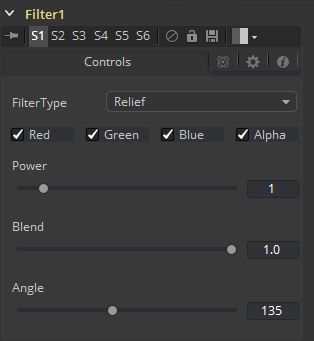

### Filter [Fltr] 滤镜

Filter工具包含多个预设滤镜，可实现从根本上改变图像的外观到添加细微随机生成的胶片颗粒等各种效果。

#### Controls 控件

##### Filter Type 滤镜类型

该下拉控件提供滤镜类型的选择。选项显示如下。

##### Relief 浮雕

这看起来像是将图像压入金属，例如硬币上的图像。图像看起来像凹凸不平并覆盖在灰色上。

##### Emboss Over 表面浮雕

通过可调整的高光和阴影及高度和方向将图像压印在其自身上方。

##### Noise 噪声

均匀地增加图像的噪点。这通常有助于需要与实景合成的3D计算机生成图像，因为它可以减少渲染图像固有的吱吱作响的干净外观。它以帧号作为随机生成器种子。因此每个帧的效果是不同的，且可重复。

##### Defocus 散焦

此滤镜类型会使图像模糊。

##### Sobel Sobel

Sobel是先进的边缘检测滤镜。与Glow滤镜一起使用时，它可以从实景或3D渲染图像中产生惊人的霓虹灯效果。

##### Laplacian Laplacian

Laplacian是一种非常敏感的边缘检测滤镜，其边缘比Sobel滤波器更精细。

##### Grain 颗粒

向类似于胶片颗粒的图像添加噪点（通常在中间范围）。这通常有助于需要与实景合成的3D计算机生成图像，因为它可以减少渲染图像固有的吱吱作响的干净外观。它以帧号作为随机生成器种子。因此每个帧的效果是不同的，且可重复。

##### Color Channels (RGBA) 色彩通道（RGBA）

滤镜默认在R、G、B和A通道上运行。通过单击每个通道旁边的复选框以使其处于活动状态或非活动状态，可以选择性地对通道使用滤镜。

##### Power 力度

值的范围是1到10。它会按比例增加所选滤镜影响图像的量。这不适用于Laplacian滤镜类型。

##### Angle 角度

此控件的范围是0到315度，并以45度为增量更改效果。这仅适用于Relief和Emboss滤镜。

##### Median 中间

根据选择的滤镜类型，控件可能会出现。它会改变中值滤镜的效果。值为0.5会产生真实的中间值，它将找到中间值。值0.0将找到最小值，而值1.0将找到最大值。仅适用于中值滤镜。

##### Seed 种子

仅当应用Grain或Noise滤镜类型时，此控件才可见。Seed滑块可用于确保效果的随机元素以一致的值使用种子。给定相同的种子值，随机化器将始终产生相同的结果。

##### Animated 使用动画

仅当应用Grain或Noise滤镜类型时，此控件才可见。选中该复选框，以使Grain或Noise在帧与帧之间变化。要产生静态噪声，请取消选中此复选框。