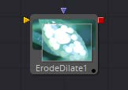

## 第十二章 Filter Tools 滤镜工具

- [CreateBumpmap [CBu]](./CreateBumpmap%20[CBu].md) 
- [Custom Filter [CFlt]](./Custom%20Filter%20[CFlt].md) 
- [Erode/Dilate [ErDl]](./ErodeDilate%20[ErDl].md) 
- [Filter [Fltr]](./Filter%20[Fltr].md) 
- [Rank Filter [RFlt]](./Rank%20Filter%20[RFlt].md) 

<table id="img">
  <tr>
    <td rowspan="5"></td>
    <td></td>
  </tr>
  <tr>
    <td></td>
  </tr>
  <tr>
    <td></td>
  </tr>
  <tr>
    <td></td>
  </tr>
  <tr>
    <td></td>
  </tr>
</table>

