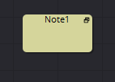

## 第十三章 Flow Tools 流程工具

- [Sticky Note [Nte] 便笺](./Sticky%20Note%20[Nte].md) 
- [Underlay [Und] 衬垫](./Underlay%20[Und].md) 

<table id="img">
  <tr>
    <td rowspan="2"></td>
    <td></td>
  </tr>
  <tr>
    <td></td>
  </tr>
</table>
