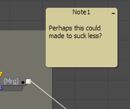
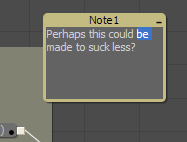

### Sticky Note [Nte] 便笺

Sticky Note是为合成的特定区域提供便笺、注释和历史记录的一种有用方法。通过更改它们的尺寸和颜色，可以根据需要提供简洁的注释或重要提示。Sticky Note是对Comments选项卡的很好补充。

#### Usage 用途

与常规工具一样，可以从Tools菜单的Flow类别中，或从流程编辑器（Flow Editor）的 Add Tool上下文菜单中选择Sticky Note，来将它添加到合成中。创建新的Sticky Note时，其标题栏位于最后单击位置的中心。

像Group一样，Sticky Note以较小的折叠形式创建。可以通过双击它们的任意位置或单击右上角的图标来展开它们。展开后，可以通过在任意一侧或角落拖动来调整大小。要再次折叠它们，再次单击右上角的图标。

像其他工具一样，可以使用流程编辑器的上下文菜单重命名、删除、复制和粘贴Sticky Note，并更改其块颜色和文本颜色。也可以锁定它们来防止编辑。

要编辑Sticky Note中的文本，请先在便笺上的任意位置双击双击以展开文本，然后在其标题栏下方单击。如果便签未锁定，则文本将变为可编辑的。