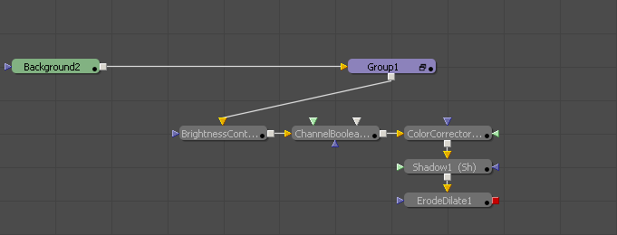
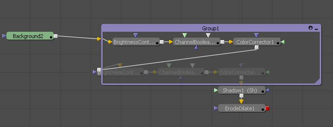

### Group

Group可通过组合多个工具来将合成整理干净。

#### Usage 使用

- 要对工具进行分组，先选择它们，然后按Command-G或Ctrl-G或右键单击并从上下文菜单中选择Group。按Command-E或Ctrl-E展开或折叠选定的组。

  

- 右键单击并从上下文菜单中选择Ungroup来取消组合所有工具。

  

- 当打开时，Group会悬浮在现有的元素之上，允许对被包含的工具进行编辑。