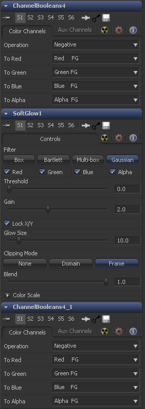

### Macro 宏

Macro可用于组合多个工具显露用户可定义的控件集。它们是构建你自定义工具的快速便捷的方式。

#### Usage 使用

##### Creating a Macro 创建一个宏

要创建宏，先选择用于宏的工具，右键单击其中任何一个，然后从上下文菜单中选择Macro> Create Macro。

##### Macro Editor 宏编辑器

然后，宏编辑器允许您指定并重命名将在最终宏中显露的控件。

在此示例中，我们仅显露了Soft Glow工具的Threshold和Gain滑块，该滑块夹在两个ChannelBoolean之间。

在按自己的喜好设置宏之后，在Macro Name字段中输入名称，然后选择File > Save。

要将宏添加到流中，请右键单击流上的任意位置，然后从上下文菜单中选择Macro > [Macro的名称]。

#### The Final Macro 最终的宏

最终的宏外观和行为与Fusion中的其他任何工具一样。

再举一个例子，您可以将一个ChannelBoolean设置为Add模式，然后使其变成一个完全不显露任何控件的宏，从而创建一个与Add等效的节点（它可以在Shake之类的程序中找到）。