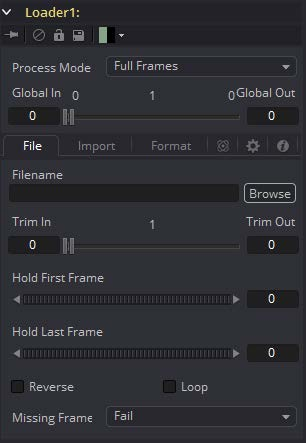
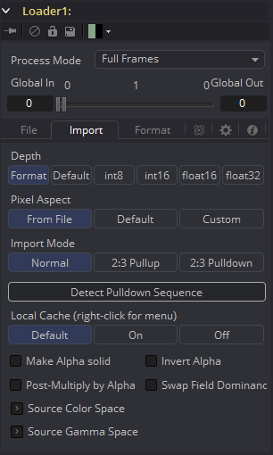
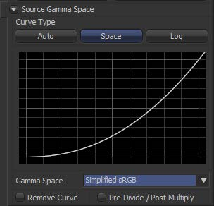
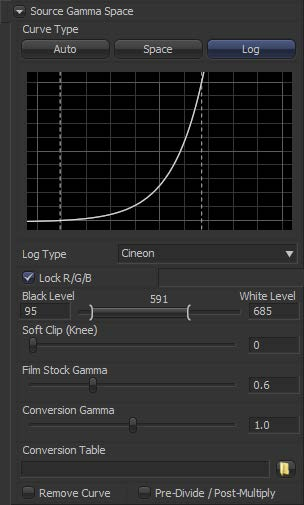
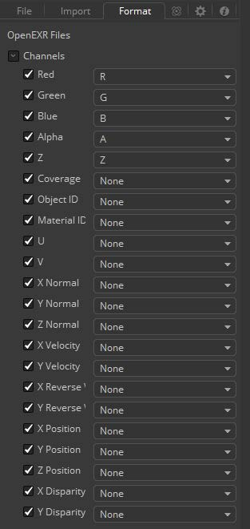

### Loader [Ld] 加载器

Loader工具用于选择并加载磁盘或网络存储器中的素材。

Loader是负责对素材的修剪、循环和延长，以及设置场序、像素宽高比和色彩深度。Loader可以说是Fusion中最重要的工具。

#### File Tab 文件选项卡

##### Filename 文件名

点击Browse（浏览）按钮将显示一个标准的Fusion文件浏览器。素材路径也可以在文本框中直接输入。

文本框支持文件名自动补全，当在文本框中输入目录名称或文件名称时，Fusion 将显示弹出列表，列出可能的匹配项。使用方向键选择正确的匹配项并完成素材路径。

当Loader添加到流程中时，将自动出现文件对话框来从硬盘中选择素材。若想之后选择素材的，请选择Cancel（取消） 按钮。Loader 仍将添加到流程中。若要禁用自动显示文件浏览器，可以通过Preferences（偏好设置）找到*Global > General* 中禁用Auto Clip Browse（自动素材浏览）。

##### File Sequences 文件序列

序列的一部分图像通常会使用文件序列的方式来识别。如果文件名的最后一部分是数字结尾（不包括文件扩展名），Fusion 将自动扫描该目录并查找与序列匹配的文件。

例如，下面的文件名将是有效的序列：

`image.0001.tga`
`image.0002.tga`
`image.0003.tga`

`image151.exr`
`image152.exr`
`image153.exr`

`image1.tif`
`image2.tif`
`image3.tif`

以下则不会被认为是一个序列，因为最后的字符不是数字：

`shot.1.fg.tga`
`shot.2.fg.tga`
`shot.3.fg.tga`

不一定要在序列中选择第一个文件；Fusion会搜索整个文件夹查找与所选文件名中的序列匹配的文件。此外，Fusion将根据文件名中的第一个和最后一个数值确定序列的长度。丢失的帧则会被忽略。

例如，如果文件夹包含以下两个名称的文件：

`image.0001.tga`
`image.0100.tga`

Fusion将视为100帧的文件序列，而不是包含两帧的文件序列。Missing Frames下拉菜单可选择让Fusion如何处理丢失的帧。Trim In/Trim Out控件的快捷菜单也可以用来指定素材的长度，或者重新扫描文件夹。对这些控件更详细的描述请见下文。

有时，你只希望从序列中读取单帧，例如，在包含许多文件的文件夹中，读取一张照片。默认情况下，Fusion将检测为序列，但如果你在文件浏览器中选择文件的同时同时按住Shift键拖拽到flow中，Fusion将只加载指定的文件，忽略序列。

此外，如果你使用屏幕右下角的预览控件，你可以`Command+单击`或`Ctrl+单击`滑块，直到想要作静帧的画面，Fusion将相应地设置Loader参数。

##### Proxy Filename 代理文件名

Proxy Filename控件只有在Filename控件指向有效素材时出现。当指定好读取的素材的同时，代理模式被启用。使得读取较小版本的图像来加快硬盘中文件写入写出的速度和处理。

例如，创建一个Cineon 电影序列的1/4大小版本作为文件代理。每当流程启用Proxy模式时，较小的分辨率代理素材从硬盘里被读取，并将所有处理以较低的分辨率执行，显著地改善渲染时间。

这在使用远程文件服务器上的大胶片时特别有用。低分辨率版本的素材可以本地存储，减少网络带宽、交互渲染时间和内存使用。

代理素材必须与源素材相同的帧数，并且素材的序列号必须以相同的帧数开始和结束。

强烈建议代理与主文件的格式完全相同。至于带选项的格式，像Cineon、DPX和OpenEXR，代理将使用与主格式相同的格式选项。

##### Trim In and Out 修剪入点和出点

Trim范围控件用于修剪素材的开头帧和结尾帧。调整Trim In从开始删除帧，Trim Out指定素材的最后一帧。这里使用的值是偏移量。Trim In中的值为5将使用第5帧作为序列的开始，忽略前四帧。值 95 将停止读取 95 以后的帧。

右键单击范围控件可以查看子菜单中显示的三个选项。

##### Autodetect Clip Length 自动检测片段长度

自上次添加或删除帧以来，将重新扫描素材（当它被加载时）。

##### Set Clip Start Frame 设置片段起始帧

选择此项将显示一个对话框，用于设置硬盘上的实际开始帧数。当文件序列的第一帧不可用时使用此选项手动设置素材的属性。

##### Set Clip Length 设置片段长度

这将设置实际素材的长度，覆盖已扫描的长度。可以用于整个素材尚未渲染及获取，与设置素材起始帧结合使用。它用于在可用素材之前定义素材长度。

例如，假设场景中只有一个可用的动画帧被预先合成。动画部门尚未渲染整个图层。无论如何是设置素材开始还是素材长度都用于定义素材，当它们可用时工程文件会读取正确的帧数。如果缺少帧数，控件会设置为等待，或渲染暂停直到帧数可用，而不是失败。

##### Hold First and Last Frame 保持第一帧和最后一帧

保持第一帧和保持最后一帧控件是将第一帧或最后一帧素材保持在指定的帧数。如果素材已经循环，则保持帧包含在循环中。

##### Reverse 反向

选中此复选框让素材反转，首先播放最后一帧，最后播放第一帧。

##### Loop 循环

选中此复选框让素材循环播放，直到项目结束。任何使用了Hold First and Last Frame，或Trim In and Out的素材，不管延长还是缩短，都包含在循环素材里。

##### Missing Frames 丢失帧

当素材缺少预期的帧数或无法读取时，缺失帧下拉菜单提供了选择 Loader方式的选项，无论哪种都能体现出来。

- **Fail 失败：**除非序列帧可用，否则Loader不会输出任何图像，渲染将中止。
- **Hold Previous 保持前一帧：**输出最后一个有效帧，直到有效帧再次可用。如果没有得到有效帧，则会失败。例如，缺少第一帧。
- **Output Black 输出黑色：**输出黑色帧直到有效帧再次可用。
- **Wait 等待：**Fusion将等待可用的帧数，每隔几秒检查一次。常用于和三维同时渲染的流程，所有渲染都将停止直到帧数出现。

#### Import Tab 导入选项卡

##### Depth 色深

此组按钮用于选择Loader素材的色彩深度。默认选项是Format。

色深由读取的文件格式支持的色彩深度决定。例如，TGA文件将自动处理为8位，因为TGA文件格式不能存储大于8位的色深。Cineon文件则读取Float等。如果格式的色深未确定，则使用Frame Format（帧格式）偏好设置中定义的默认深度。

支持多种色彩深度的格式将自动适配色深。

- **Default 默认：**色彩深度由工程文件首选项的帧格式设置决定。
- **Int 8-bit/Int 16-bit/Float 16/Float 32 8位整型/16位整型/浮点16位/浮点32位：**这些选项是设置处理图像的色彩深度。有关更完整的色彩深度及其如何影响工程文件的讨论，请参阅本手册的"Frame Format 帧格式"章节。

##### Pixel Aspect 像素宽高比

此组按钮用于确定图像的像素宽高比。

- **From File 来自文件：**Loader符合已存文件检测到的图像宽高比。这里有几款可以保存宽高比信息的格式。TIFF、JPEG 和OpenEXR就是例子，可以把像素宽高比嵌入在文件头部信息中的。当没有保存宽高比信息的文件，则使用默认的帧格式方式。
- **Default 默认：**任何有像素宽高比信息的图像文件都将被忽略。将使用工程的Frame Format（帧格式）偏好设置中设置像素宽高比。

- **Custom 自定义：**选择此项可无视偏好设置并手动设置素材的像素宽高比。选择此按钮将显示X/Y像素宽高比控件。有关更完整的像素宽高比及其如何影响工程的讨论，请参阅本手册的"Frame Format 帧格式"章节。

##### Custom Pixel Aspect 自定义像素宽高比

仅当使用Custom像素宽高比方式时，此控件才可见。输入所需的宽高比，或右键单击控件以显示常用帧格式和宽高比的快捷菜单。

##### Import Mode 导入模式

此菜单提供删除图像序列中pull-up的选项。Pull-up是将24fps的素材转换成30fPs的可逆推方式。它常用于播放电影的NTSC版本。

- **Normal 正常：**图像不应用pull-up和pull-down。
- **2:3 Pull Up 2:3升格：**这将删除应用于图像序列的现有3:2降格，从 30fps转为24fps 。
- **2:3 Pull Down 2:3降格：**该素材将应用降格，将 24fps素材通过每四个中创建5帧来转换为 30fps。处理模式设置为PullDown的Loader应始终为Full Frames。

##### First Frame 第一帧

该控件用于确定3:2序列的哪个帧被用作Loader素材的第一帧。仅在选择了导入模式的Pull-up或Pull-down选项时才会出现。

##### Detect Pulldown Sequence 检测降格序列

按此按钮将使Fusion尝试自动检测并设置素材的升格序列。仅在选择导入模式的Pull-up或Pull-down选项时才会出现。如果成功检测到序列，则第一帧控件将自动设为正确的值。

##### Make Alpha Solid 设为实心Alpha

选中后，片段的原始Alpha通道将被清除并设置为纯白色（完全不透明）。

##### Invert Alpha 反转Alpha

选中后，片段的原始 Alpha 通道将被反转。这也能与Make Alpha Solid配合使用，将Alpha 设置为纯黑色（完全透明）。

##### Post-multiply by Alpha 后乘Alpha

选择此选项会使每个像素的颜色值乘以该像素的Alpha通道。此选项可用于转换减法（非预乘）图像到加法（预乘）图像。

##### Swap Field Dominance 交换优先场

当选择此控件后，图像的场序（优先）将被交换，因此，该场出现的时间顺序是相反的。与Process Mode控件不同，这是在不交换图像中的扫描线即可完成此操作。

##### Source Color Space 源色彩空间

设置素材的色彩空间，来帮助实现线性工作流程。

与Gamut工具不同，它不会执行任何实际的色彩空间转换，而是将源空间数据添加到元数据中（如果该元数据还没有的话）。然后，元数据可以由带有From Image选项的色域工具一起在下游使用，或在Saver节点中（如果在其中定义了明确的输出空间）。

- **Auto 自动：**传递导入图像中可能存在的任何元数据。
- **Space 空间：**允许用户从各种选项中设置色彩空间。

##### Source Gamma Space 源伽马空间

确定素材的Gamma空间，并提供移除Gamma曲线的选项，有助于实现线性工作流程。

- **Auto 自动：**传递导入图像中可能存在的任何元数据。
- **Space 空间：**允许用户从各种选项中设置色彩空间。
- **Log 对数：**打开Log/Lin设置，类似于Cineon工具。

##### Remove Curve 移除曲线

取决于所选的Gamma空间或在Auto模式下找到的Gamma空间，相关的 Gamma曲线已从中移除，或对素材进行了log-lin转换加工，有效地将其转换为线性输出空间。

#### Format Tab 格式选项卡

格式选项卡包含与加载图像格式相关的信息、选项和设置。并非所有文件格式都有选项。值得注意的是，Cineon、DPX、PSD、OMF、OpenEXR 和 QuickTIme 格式在加载时，均提供附加选项。有关所有支持格式的说明，请参阅附录A“File Formats 文件格式”。

JPG和DPX的选项显示在右侧，以供参考。

##### OMF Format OMF格式

OMF文件不仅仅是一种媒体格式；它可以包含有关编辑、多个序列甚至同一镜头多种版本的信息。如果OMF文件中存在多个片段，Format选项可用来选择所需的片段。若要从OMF文件中导入所有的片段，以及编辑和合并信息的完整内容，请使用Fusion的File菜单中的Import OMF File选项来根据OMF内容创建完整的合成。

##### Photoshop PSD Format Photoshop PSD格式

Fusion可以加载存储在PSD文件中的任何一个独立图层，也可以加载包含所有图层的完整图像。但不支持转换和调整层。要从PSD文件中加载所有独立图层，并使用适当的混合模式将它们组合在一起，请使用Fusion的File菜单中的Import PSD选项从PSD文件的内容中创建完整的合成。

##### Cineon and DPX Format Cineon和DPX格式

有关 Cineon 和DPX 文件格式选项的详细讨论，请参阅Film一章和Cineon Log工具一章。

##### OpenEXR Format OpenEXR格式

Industrial Light and Magic（工业光魔）开发了 OpenEXR 格式。它的最初设计是提供一种简洁灵活的格式以支持高动态范围图片（float）的存储。该格式已扩展为支持各种额外的通道和元数据。

OpenEXR文件格式的选项提供了一种机制，从非RGBA通道映射到Fusion本身支持的通道。在OpenEXR文件中，Fusion通道名称旁边的任意编辑框中输入通道的名称。可以在以下位置找到用于转储通道名称的命令行实用程序：http://www.openexr.com/。

##### QuickTime

QuickTime文件可能包含多个轨道。使用Format选项选择其中一个轨道。

##### 图像文件列表

Fusion还支持一种更有趣的格式就是Image File List（图像文件列表）格式。IFL实际上是一个文本文件，其中包含应加载的文件列表。使用IFL文件指定任意命名文件或来自不同目录的文件序列。

#### Common Controls 通用控件

##### Process Mode 处理模式

使用此菜单可选择加载图像时Fusion 使用的场处理模式。默认选项由偏好设置中Frame Format（帧格式）中的Has Fields复选框控件以及默认高度来决定。可用选项包括全帧、NTSC场，PAL/HD 场，PAL/HD 场（反向）和 NTSC 场（反向）。两个反向的选项按相反的顺序加载场，因此将导致场同时按照时间顺序和垂直顺序进行交换。采用Reverse Dominance复选框（在下面的Import选项卡中进行了说明）仅在时间上交换场。

有关Fields Processing（场处理）的更多信息，请参阅“Frame Formats 帧格式”一章。

##### Global In and Out 全局输入和输出

使用此控件可以指定此工具在工程中的位置。使用Global In指定片段起始帧，使用Global Out指定片段在工程Global Range内结束。该工具不会在超出此范围的帧上生成图像。

如果全局输入和输出值减小到两值间范围小于片段可用帧的数量，Fusion 将通过调整Clip Time范围控件自动修剪片段。如果Global In/Out值增加到两值间范围大于片段可用帧的数量，Fusion将通过调整Hold First/Last Frame控件来自动延长片段。

扩展帧在范围控制中通过在控制中将所保留帧的颜色更改为紫色来直观地表示。

若要在时间上滑移片段或在不更改项目长度的情况下将其移动，请将鼠标指针放置在范围控制的中间，并将其拖到新位置，或在Global的控件中手动输入数值。

> #### **Magic Comp 变量**
>
> 本示例中的路径名以*Comp:\\*开始。
>
> Fusion中的Comp变量适用于Loader和Saver节点，并帮助你在工作中保持井井有条。*Comp:\\*表示您的实际合成所储存在的文件夹。
>
> 因此，只要你所有的素材都存储在Comp文件夹的子文件夹中，无论实际的硬盘驱动器或网络共享名称是什么，Fusion都会找到该素材。
>
> 例如，你可以将整个镜头从网络复制到本地驱动器，按照Comp变量设置你的Loader和Saver节点，就可以在本地实现所有事情（即设置您的合成），然后只要将合成复制回服务器并发布网络渲染。
>
> 所有渲染设备都会自动找到源素材。
>
> ##### **一些示例：**
>
> 你的合成存储在
> `X:\Project\Shot0815\Fusion\Shot0815.comp`
> 你的源素材位于
> `X:\Project\Shot0815\Fusion\Greenscreen\0815Green_0000.dpx`
> Loader中的相对路径为：
> `Comp:\Greenscreen\0815Green_0000.dpx`
> 如果你的源素材存储在
> `X:\Project\Shot0815\Footage\Greenscreen\0815Green_0000.dpx`，
> Loader中的相对路径则为：`Comp:\..\Footage\Greenscreen\0815Green_0000.dpx`
>
> 观察这两个点，如何将目录设置为上一个文件夹；差不多与命令行窗口中的`CD ..`相同。