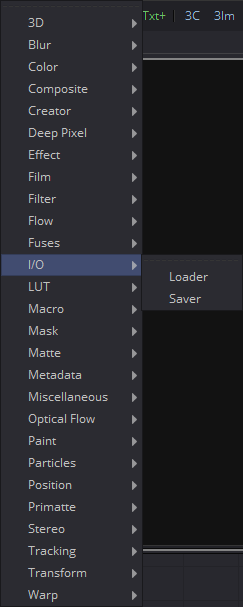
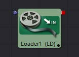

## 第十六章 I/O Tools 输入输出工具

- [Loader [Ld] 加载器](./Loader%20[Ld].md) 
- [Saver [Sv] 保存器](./Saver%20[Sv].md) 

<table id="img">
  <tr>
    <td rowspan="3"></td>
    <td></td>
  </tr>
  <tr>
    <td></td>
  </tr>
</table>