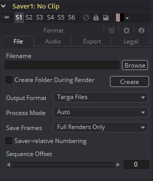
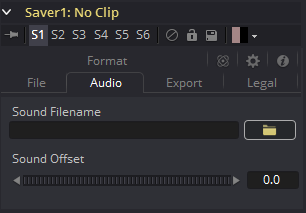
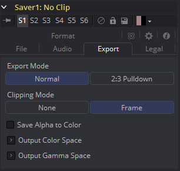
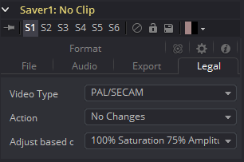
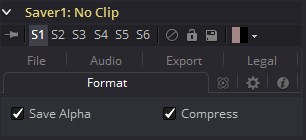

### Saver [Sv]

Saver负责将合成的结果写入到磁盘。它可以在任何时候插入到合成中。Saver工具还可以用于向您的流程节点中添加临时曲目音频，可以在交互式回放时听到这些音频。

合成可以包含任意数量的Saver工具，并且Saver可以放置在流程的任何位置上。

#### File Tab 文件选项卡

##### Filename 文件名

序列号在渲染时会自动添加到文件名中。例如，如果输入*c\renders\image.tga*作为文件名，则输出30帧渲染后，文件将自动编号为*image0000.tga*，*image0001.tga*，*image0003.tga*...等等。对于小于10000的数字，会自动使用四位数来填充。

通过在文件名中显式输入数字，指定用于填充序列号的位数。

例如，image000000.tga将对数字序列应用6位填充，image.001.tga将使用3位数填充，而image1.tga将不使用任何填充。

##### Saving to an Image File List 保存到图像文件列表

如果需要对写入磁盘的文件名进行更多的控制，则可以保存IFL文件到此处。要创建IFL，请创建扩展名为.ifl的文本文件。文本文件的每一行都是输出单帧的指定名称。

例如，使用罗马数字而不是小数来渲染文件序列编号将创建以下文件：

`image.i.tga`
`image.ii.tga`
`image.iii.tga`
`image.iv.tga`
`image.v.tga`

如果没有足够的行来匹配渲染的帧数，渲染将会失败。在上面的示例中，渲染将在第五帧之后失败。

使用图像文件列表保存到磁盘时，无法指定格式选项。将改为使用默认值。

##### Output Format 输出格式

使用此控件选择要保存的图像格式。从该菜单中选择新格式不会更改文件名中使用的扩展名以使其匹配。手动修改文件名来匹配该格式的预期扩展名，来避免名称和图像格式之间的不匹配。

有关Fusion支持保存的文件格式列表，请参阅附录A。

##### Process Mode 处理模式

处理模式菜单用于设置流程渲染时Fusion使用的场处理方法。

默认选项是Auto（自动）。这将使用在流程中大多数背景Loader或Creator工具的处理模式中设置场序。

若要强制流程渲染单个场或完整帧，而不考虑流程中其他工具的设置，请将此菜单的设置更改为列出的其中一项。

例如，如果Saver的处理模式设置为“ NTSC场”，则设置为处理全帧的Loader仍将从磁盘加载全帧，但是应用于该层的动画将以场级精度应用。在所有情况下，如果需要，素材都会重新进行隔行扫描，并保存为帧在您的磁盘上。

有关Fusion中帧和场处理的更多详细信息，请参见“Frame Format 帧格式”一章。

##### Save Frames 保存帧

该控件在两种模式之间进行选择。 

- **Full Renders Only 仅完整渲染：**只有在时间标尺中的Start Render按钮开始最终渲染时，图像才会保存到磁盘。
- **High Quality Interactive 高品质交互：**此渲染模式设计用于在绘制和动态遮罩时进行实时渲染。Fusion将在交互处理每一帧时将其保存到磁盘。

如果使用正确，此功能可以完全消除在动态遮罩后执行最终渲染的需要。当与包含样条线动画参数的流程一起使用时，它可能会导致极大的混乱。

如果修改这些样条线时更改了已经交互保存的帧，则不会自动重新渲染已在磁盘上的帧。要么再次逐步执行每一帧或执行最终渲染以确保结果是正确的。

##### Set Sequence Start 设置序列起始

通常，Fusion将使用合成的渲染范围来确定将文件序列渲染到磁盘时使用的数字序列。启用此复选框来显示序列起始帧控制，可将序列中的起始编号调整为自定义值。 

##### Sequence Start Frame 序列起始帧

此指轮控件能为应用于渲染文件名的数字序列设置一个显式的起始帧。例如，如果全局开始设置为1并且已经渲染了第1-30帧，则文件通常编号为0001-0030。如果序列起始帧设置为100，则渲染的输出编号为100-131。 

#### Audio Tab 音频选项卡

音频功能包含在Fusion中，仅用于临时轨道（将效果与音频和片段时间对齐）目的。最终渲染几乎总是在没有音频的情况下进行。应使用尽可能小的音频文件，因为Fusion会将整个音频文件加载到内存中，以便在时间轴中高效显示波形。

如果选择了QuickTime或AVI文件格式，则音轨将包含在保存的图像中。Fusion目前支持播放WAV音频。

##### Audio Browse 音频浏览

选择要使用的可选临时音轨。选择所选的* .WAV文件，然后展开时间线布局中的Saver片段，以查看音频波形。在时间线布局中的音频波形上拖动指针，即可收听轨道。

##### Sound Offset 声音偏移

向左或向右拖动控制可在流程的音频和图像之间创建时间偏移。

#### Export Tab 导出选项卡

##### Export Mode 导出模式

此菜单用于将SMPTE标准3:2 pulldown应用于保存到磁盘的素材，将素材从24fps转换为30fps。

##### First Frame 第一帧

第一帧通过选择从24fps源中组合哪些帧以在30fps pulldown 结果中创建第一帧来确定3:2 pulldown的节奏。通常，应将其留给AA。当保存一个原来就有pulldown的片段时，该pulldown已被移除以应用效果，并且需要将其重新插入到现有的编辑中，可能需要匹配原始片段的节奏。

##### Clipping Mode 裁剪模式

这些单选按钮定义如何处理图像边缘。这也可以被称为源图像裁剪。

它们默认为Frame，这将提供与以前Fusion版本相同的行为。由于此选项将裁剪可见部分范围的图像尺寸，因此它将破坏任何无限工作空间的行为。

如果上游的DoD（定义域）小于该Frame，则框内剩余区域将被视为黑色/透明。None是根本不执行任何源图像裁剪。

这意味着通常需要在上游DoD以外的任何数据被视为黑色/透明。请注意，这可能会产生巨大的图像，同时会消耗大量的磁盘空间。因此，只有在真正需要的时候才应该使用这个选项。

有关ROI（感兴趣区域）、DoD（定义域）和Infinite Workspace（无限工作空间）的更多信息，请参阅相关章节。

##### Save Alpha to Color 将Alpha保存为颜色

选中后，此控制将导致Alpha通道作为灰度图像保存为颜色通道。这将完全覆盖任何现有的颜色信息。

#### Legal Tab 合法化选项卡

##### Video Type 视频类型

选择用于广播合法颜色校正的标准。可以选择NTSC、NHK或PAL/SECAM。

##### Action 方案

使用此菜单可以选择Fusion如何处理图像中的非法颜色。

- **Adjust to Legal 调整为合法：**这将导致以与所选视频类型相关的合法颜色保存图像。
- **Indicate as Black 显示为黑色：**这将导致视图中的非法颜色显示为黑色。
- **Indicate as White 显示为白色：**这将导致视图中的非法颜色显示为白色。
- **No Changes 不改变：**这会使保存图像不受影响。

##### Adjust Based On 调整依据

此菜单用于选择Fusion将图像合法化为75％还是100％的幅度。很少有广播市场允许100％的幅度，但是大多数情况下这应该保持在75％。

#### Format Tab 格式选项卡

格式选项卡包含特定于要保存的图像格式的信息、选项和设置。TGA序列的控制将与保存DPX文件时显示的控制完全不同。

TGA和DPX显示在右侧，以供参考。

当Saver设置为DPX时，了解“Data is Linear”选项的原理很重要。将log数据保存到DPX中时，并且不使用Saver自己的lin-log转换（即选中“Bypass Conversion”）时，“Data is Linear”选项应关闭。这表示检查“Bypass Conversion”的原因是因为数据为线性，或者因为它已经是log。

如果启用了“Data is Linear”，则DPX在其头文件中标记为包含线性的数据。反之，这意味着当DPX重新加载到Fusion或其他评估头文件的应用程序，这些应用程序会认为数据是线性的，并且不会执行任何log-lin的转换。

> #### **Magic Comp 变量**
>
> 本示例中的路径名以*Comp:\\*开始。
>
> Fusion中的Comp变量适用于Loader和Saver节点，并帮助你在工作中保持井井有条。*Comp:\\*表示您的实际合成所储存在的文件夹。
>
> 因此，只要你所有的素材都存储在Comp文件夹的子文件夹中，无论实际的硬盘驱动器或网络共享名称是什么，Fusion都会找到该素材。
>
> 例如，你可以将整个镜头从网络复制到本地驱动器，按照Comp变量设置你的Loader和Saver节点，就可以在本地实现所有事情（即设置您的合成），然后只要将合成复制回服务器并发布网络渲染。
>
> 所有渲染设备都会自动找到源素材。
>
> ##### **一些示例：**
>
> 你的合成存储在
> `X:\Project\Shot0815\Fusion\Shot0815.comp`
> 你的源素材位于
> `X:\Project\Shot0815\Fusion\Greenscreen\0815Green_0000.dpx`
> Loader中的相对路径为：
> `Comp:\Greenscreen\0815Green_0000.dpx`
> 如果你的源素材存储在
> `X:\Project\Shot0815\Footage\Greenscreen\0815Green_0000.dpx`，
> Loader中的相对路径则为：`Comp:\..\Footage\Greenscreen\0815Green_0000.dpx`
>
> 观察这两个点，如何将目录设置为上一个文件夹；差不多与命令行窗口中的`CD ..`相同。