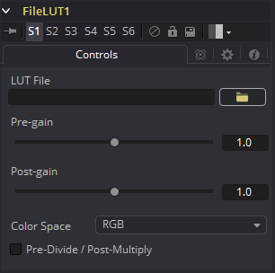

### File LUT [FLUT]

LUT文件工具将查找表（Look-Up Table, LUT）应用于图像，可以是简单的1D LUT，也可以是支持的3D LUT。与Color Curves工具不同，它不使用基于样条线的LUT。相反，它从存储在系统或网络上的文件加载LUT。

这种方法有两个优点。第一种情况是合成中存储LUT的唯一部分是文件的路径。由于LUT文件可能很大，因此当存在多个LUT时，这可以明显减小合成的文件大小。第二个优点是可以同时使用同一个文件调整所有LUT文件工具，只需更改LUT的内容。当在许多不同的合成中应用基于同种LUT的色彩校正时，这将会非常有用。

#### Controls 控件

##### LUT File LUT文件

使用该控件选择LUT文件的路径。目前，该工具支持从Fusion导出的.LUT和.ALUT格式、Shake的LUT格式，以及多种3D LUT格式。如果无法找到或加载指定的文件，工具将失败，并在控制台里显示一条错误消息。

##### Color Space 色彩空间

使用该控件可以更改应用LUT的色彩空间。默认设置是将LUT中描述的曲线应用于RGB色彩空间，但也可以使用YUV、HLS、HSV和其他选项。

##### Pre-Divide/Post-Multiply 预除/预乘

选中Pre-Divide/Post-Multiply复选框将导致在应用LUT之前先将图像的像素值除以alpha值，并在校正后再乘以alpha值。

这可以防止创建非法的加性图像，尤其是在蓝色/绿色键控的边缘或处理3D渲染对象时。