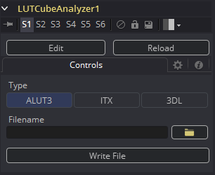

### LUT Cube Analyzer [LCA] LUT Cube分析器

LUT Cube Analyzer将LUT Cube Creator创建的图像作为输入，并允许用户创建ALUT3、ITX或3DL格式的3D LUT文件。

将原始图像输入到该工具将产生未更改或1:1的 LUT文件。

而且你也可以使用任意数量的工具对原始Cube图像进行修改、调色和色彩校正，然后将结果输入到LUT Cube Apply中。 这将创建一个与你的颜色管线完全相似的LUT。

#### Controls 控件

将修改使用LUT Cube Creator创建图像的任何工具的输出连接到Analyzer的输入，查看Analyzer，选择所需的输出格式，指定一个文件名，然后按下Write File（写入文件）创建3D LUT。

##### Type 类型

选择所需的3D LUT输出格式。

##### Filename 文件名

指定要写入LUT文件的路径和名称。

##### Write File 写入文件

按下此按钮可根据上述设置生成3D LUT文件。