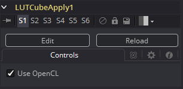

### LUT Cube Apply [LCP] LUT Cube应用

LUT Cube Apply将由LUT Cube Creator创建的图像作为前景输入并将该LUT应用于连接到背景输入的图像。

将原始图像输入到该工具将产生未更改或1:1的 LUT文件。

而且你也可以使用任意数量的工具对原始Cube图像进行修改、调色和色彩校正，然后将结果输入到LUT Cube Apply中。 或者，使用预调色的LUT图像来应用LUT，而不必使用LUT Cube Analyzer写入实际的3D LUT。

#### Controls 控件

将要根据LUT修改的任何图像连接到工具的背景输入。将LUT Cube图像连接到工具的前景输入。

##### Use OpenCL 使用OpenCL

如果您的图形卡支持OpenCL，启用此选项将极大地加快对此工具的处理速度。