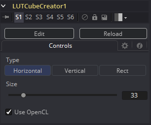
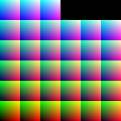
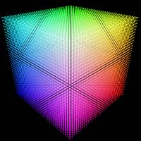

### LUT Cube Creator [LCC] LUT Cube创建器

LUT Cube Creator创建一张用于之后提供给LUT Cube Analyzer或LUT Cube Apply使用的图像。输出可以让Fusion内外的任何工具进行调色、色彩校正或修改。如果在Fusion之外工作，请确保将图像保持为32位浮点，来确保色彩的精度。

#### Controls 控件

##### Type 类型

- **Horizontal 水平：**创建一个表示色彩Cube的水平长条。
- **Vertical 垂直：**创建一个表示色彩Cube的垂直长条。
- **Rect 矩形：**创建一个表示色彩Cube的矩形图像（如下图所示）。

##### Size 尺寸

确定色彩Cube的分辨率。

>  **注意：**更高的分辨率可以产生更准确的结果，但同时也具有更大的内存和计算量。

色彩立方体的常用值为17x17x17或33x33x33，或者以数学形式表示n ^ 2 + 1。

##### 使用 OpenCL

如果你的显卡支持OpenCL，启用该选项将加快对此工具的处理速度。

使用Rect类型创建的Cube图像

生成的色彩立方体