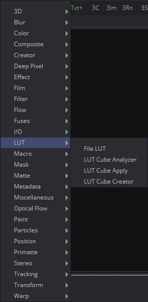
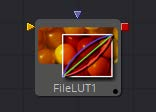

## 第十七章 LUT Tools LUT工具

- [File LUT [FLUT]](./File%20LUT%20[FLUT].md) 
- [LUT Cube Analyzer [LCA]](./LUT%20Cube%20Analyzer%20[LCA].md)
- [LUT Cube Apply [LCP]](LUT%20Cube%20Apply%20[LCP].md)
- [LUT Cube Creator [LCC]](./LUT%20Cube%20Creator%20[LCC].md)

<table id="img">
  <tr>
    <td rowspan="4"></td>
    <td></td>
  </tr>
  <tr>
    <td></td>
  </tr>
  <tr>
    <td></td>
  </tr>
  <tr>
    <td></td>
  </tr>
</table>

