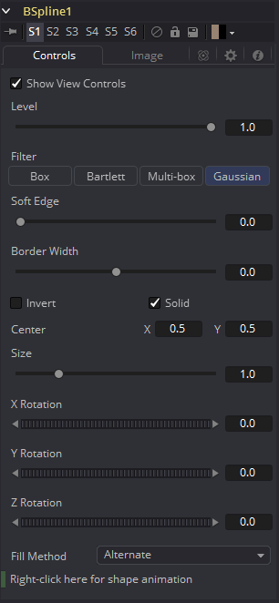
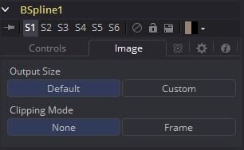

### B-Spline Mask [BSp] B样条遮罩

B-Spline遮罩只有一个地方是与Polygon遮罩不同的，其他都完全一样。也就是Polygon遮罩使用Bezier（贝塞尔）样条，而本遮罩工具使用了B样条。贝塞尔样条使用一个主点和两个手柄来管理样条段的平滑，而B样条只需要单独的一个点。这也就意味着B样条形状需要远远更少的控制点来创建一个好看的平滑图形。

B样条的平滑度取决于控制点的张力。要调整B样条控制点的张力，选中该点，按住W键并向左或向右拖动鼠标指针来增加或减少通过该点曲线的张力。

该遮罩工具的很多控件都可以在所有遮罩工具中找到通用的。这些控件在“Common Mask Controls 通用遮罩控件”中介绍。

#### Controls 控件

##### Level, Filter, Soft Edge and Border Width 级别、滤镜、柔边和边框宽度

请参阅“Common Mask Controls 通用遮罩控件”。

##### Size 尺寸

使用Size控件来调整B样条效果遮罩的缩放，而不会影响到组成遮罩的点或设置遮罩动画的相对行为。

##### X, Y and Z Rotation X、Y和Z旋转

使用这些控件来调整效果遮罩沿着任意轴的旋转角度。

##### Fill Method 填充方法

Fill Method下拉菜单提供了两种处理多边线重叠区域的方法。如果遮罩中的重叠部分导致了不想要的洞，尝试将该控件的值将Alternate（奇偶填充）更改为Non Zero Winding（非零环绕填充）。

##### Right Click Here for Shape Animation 右键单机此处以创建形状动画

默认情况下，所有B样条遮罩在创建时就添加了动画。初始关键帧被设置为当前时间，在不同时间对形状做出任何更改都会创建新的关键帧。

右键单击该标签会现实一个上下文菜单，它提供了对该遮罩移除或重新添加动画的选项，或者公开（Publish）并连接遮罩。

#### Adding Points 添加点

向B样条效果遮罩添加点是相对简单的。创建遮罩后是没有点的，但是遮罩将处于Click Append（单击追加）模式。只需在查看器中单击一次，仅在遮罩需要点的地方。继续单击以绘制遮罩的形状。

形状完成后，再次单击初始点来闭合遮罩。

当形状闭合时，多边形折线的模式会更改为Insert（插入）和Modify（修改）。这允许通过单击多边线的线段来调整和添加额外的点到遮罩。若要锁定遮罩的形状并防止意外更改，请使用Polyline工具栏或右键菜单将Polyline模式切换设置为Done（已完成）。

将B样条线遮罩添加到工具时，视图中将显示一个工具栏，其中的按钮可提供轻松地访问模式和工具。将鼠标指针悬停在工具栏中的任意按钮上会显示说明该按钮功能的工具提示。

通过在工具栏上鼠标右键单击，选择右键菜单中显示的选项中，来更改工具栏的显示方式。

此工具栏中按钮的功能在“Polyline 多边线”一章中有详细说明。

#### Image Tab 图像选项卡

请参阅“Common Mask Controls 通用遮罩控件”。

