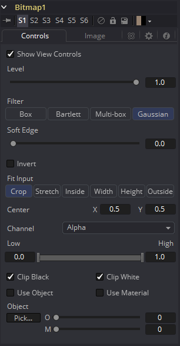
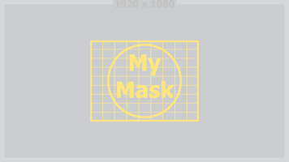
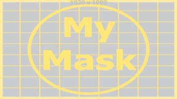
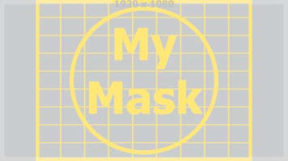
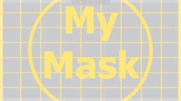

### Bitmap Mask [Bmp] 位图遮罩

Bitmap遮罩允许流程中的图像充当工具和效果的遮罩。位图遮罩可以基于图像的任何颜色、alpha、色相、饱和度、亮度和辅助覆盖通道的值。也可以根据3D渲染图像的对象或材质ID进行遮罩（前提是在渲染文件时包括了这些通道）。

任何工具的输出都可以直接连接到另一个工具的“效果遮罩”输入上。许多常见任务不需要位图遮罩工具。如果直接连接输出，则遮罩工具的“通用控制”标签将显示一个控制，用于选择使用遮罩图像的哪个通道来创建遮罩。

但是，位图遮罩工具可能仍然需要连接到某些工具上的其他遮罩输入，例如垃圾遮罩和预遮罩。此外，在遮罩源和目标工具之间使用位图遮罩工具提供了直接连接时不可用的附件选项，例如组合遮罩、模糊遮罩或裁剪其阈值。

此遮罩工具中找到的许多控制对所有遮罩工具都是公用的。这些控制在“通用遮罩控制”中有说明。

#### Controls 控件

##### Level, Filter, Soft Edge and Border Width级别、滤镜、柔边和边框宽度

请参阅“Common Mask Controls 通用遮罩控件”。

##### Fit Input 适配输入

此控制定义如果图像源不符合生成遮罩的尺寸，则如何处理该图像源。

想象一下一个720 * 576的图像源被用来生成1920x1080的遮罩。

在以下部分中，我们将图像源称为720x576图像（黄色），将遮罩称为实际生成的遮罩（灰色）。

##### Crop 裁剪

如果图像源小于生成的遮罩，它将根据X / Y控制放置，仅掩盖一部分的遮罩。如果图像源大于生成的遮罩，它将根据X / Y控制放置并在遮罩的边界处裁剪。

##### Stretch 拉伸

图像源将以X和Y方向拉伸来适应生成遮罩的全部尺寸。这可能会导致图像源明显的伪影。

##### Inside 内部

图像源将均匀缩放，直到其中一个尺寸（X或Y）适合遮罩的内部尺寸。取决于图像源和遮罩背景的相对尺寸，可以裁剪图像源的宽度或高度来适配遮罩的相应尺寸。

##### Width 宽度

图像源将均匀缩放，直到其宽度（X）符合遮罩的宽度。根据图像源和遮罩的相对尺寸，图像源的Y尺寸可能与遮罩的Y尺寸不匹配，从而导致图像源在Y中被裁剪或图像源不完全覆盖遮罩的高度。

##### Height 高度

图像源将均匀缩放，直到其高度（Y）符合遮罩的高度。根据图像源和遮罩的相对尺寸，图像源的X尺寸可能与遮罩的X尺寸不匹配，从而导致图像源在X中被裁剪或图像源不完全覆盖遮罩的宽度。

##### Outside 外部

图像源将均匀缩放，直到其中一个尺寸（X或Y）与遮罩的外部尺寸相匹配。取决于图像源和遮罩的相对尺寸，图像源的宽度或高度可能被裁切或不适配遮罩的相应尺寸。

#### Other Controls 其他控件

##### Channel 通道

使用此控件来选择用于创建遮罩输入图像的通道。可以选择Red、Green、Blue和Alpha通道或Hue、Luminance和Saturation的值或输入图像的辅助Coverage通道（如果提供的话）。

##### Threshold Low/High 阈值 低/高

Threshold范围控件可用于裁剪位图图像。增加Low控件的值会将低于指定值的像素裁剪为黑色（0.0）。减少High控件的值将强制高于指定值的像素变为白色（1.0）。

##### Use Object/Use Material 使用物体/使用材质

该控件只有在输入图像包含Material ID或Object ID是起作用。当勾选时，选中的Object ID和/或Material ID会用于创建一个基于选择对象或材质的遮罩。当取消勾选时，则使用常规的颜色通道生成遮罩。

#### Image Tab 图像选项卡

请参阅“Common Mask Controls 通用遮罩控件”。