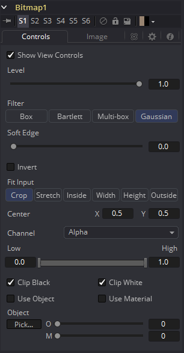
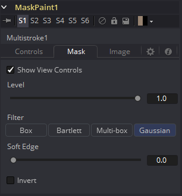

### Common Mask Controls

通用控制可以在每个遮罩工具中找到。因此，本章适用于所有遮罩工具。

#### Common Mask Controls 通用遮罩控件

尽管每个遮罩都有自己的一组独有的控件集，但显示的几个控制对于所有类型的遮罩都是通用的。此处列出的控制通常于所有的遮罩。

##### 显示视图控制

使用“显示视图控制”复选框可禁用在检视器中显示遮罩控制。即使选择了该工具，也不会显示折线、中心、角度和其他控制。

##### 级别

级别控制指定遮罩通道中像素的透明度级别。当值为1.0时，效果遮罩是完全不透明的（除非它有柔边）。较低的值将导致遮罩部分透明。其结果与降低混合控制的效果是一致的。

> **注意：** 降低遮罩的级别会降低遮罩通道中其覆盖的所有像素。例如，如果将圆形遮罩放置在矩形遮罩上，降低圆形遮罩的级别将降低遮罩通道中所有像素的值，而不管其下面的矩形遮罩，仍然是不透明的。

##### Filter 滤镜

该控制选择对遮罩应用柔边时要使用的滤镜算法。

- **Box：**这是最快的方法，但是质量下降。这最适合非常少量的模糊
- **Bartlett：**也被称为金字塔滤镜，Bartlett在速度与质量之间做了很好的妥协。
- **Multi-box：**选择此滤镜时，会出现“Num Passes（次数）”滑块以便控制质量。在1次和2次时，结果分别与Box和Bartlett相同。4次及4次以上的结果通常与Gaussian一样好，计算时间更短，并且没有边缘“振铃”。
- **Gaussian：**默认滤镜，它使用了真正的高斯近似法，并提供了出色的结果，但是它比其他滤镜要慢一些。在某些情况下，它会在浮点像素上产生非常轻微的边缘“振铃”。

##### Soft Edge 柔边

使用“柔边”滑块，使用选定的滤镜来模糊（羽化）遮罩边缘。较高的值将导致边缘在遮罩边界之外逐渐消失。值为0.0将创建清晰明确的边缘。

##### Border Width 边框宽度

边框宽度控制可调整遮罩边缘的厚度。打开“实体”复选框时，边框会加厚或变窄此遮罩。当遮罩不是实体时，将绘制遮罩形状的轮廓并使用此控制处理轮廓的厚度。

#### Paint Mode 绘制模式

尽管每个遮罩都有自己的一组独有的控件集，但显示的几个控制对于所有类型的遮罩都是通用的。此处列出的控制通常于所有的遮罩。

##### Merge 合并

合并是所有遮罩的默认值。新的遮罩与输入遮罩合并在一起。

##### Add 添加

遮罩的值将添加到输入遮罩的值中。

##### Subtract 减去

在相交区域中，将从输入遮罩的值中减去新遮罩的值。

##### Minimum最小值

将输入遮罩的值与新遮罩的值进行比较，并取最低值（最小值）。

##### Maximum 最大值

将输入遮罩的值与新遮罩的值进行比较，并取最高值（最大值）。

##### Average均值

这将计算新遮罩和输入遮罩的平均值（总和的一半）。

##### Multiply 乘

这会将输入遮罩的值乘以新遮罩的值。

##### Replace 替换

新的遮罩在输入遮罩相交的地方完全替换它们。新遮罩中为零（完全黑色）的区域不会影响输入遮罩。

##### Invert反向

新遮罩覆盖的输入遮罩区域是反转的；白色变成黑色，反之亦然。新遮罩中的灰色区域部分被反转。

##### Copy 复制

此模式完全放弃输入遮罩，并对所有值使用新遮罩。

##### Ignore 忽视

此模式完全丢弃新的遮罩，并对所有值使用输入遮罩。

##### Invert 反向

选中此复选框将反转整个遮罩。这与“反向绘制”模式不同，因为它会影响所有像素，而不管它们是否被新遮罩覆盖。

##### Solid 实体

启用“实体”复选框时，完全由遮罩封闭所有区域并填充为纯白色。禁用该复选框将把遮罩视为轮廓，轮廓的宽度由“边框宽度”控制来决定。默认情况下，此复选框已处于启用状态。

##### Center 中心

所有遮罩都有一个中心，除了创建工具上的通用控制，例如“ Background（背景）”和“Fast Noise（快速噪波）”。

##### Process Mode 处理模式

使用此菜单控制来选择Fusion用于渲染的场处理模式更改为遮罩。默认选项由首选项中“帧格式”中的“有场”复选框控制来决定。有关场处理的更多信息，请参阅“帧格式”部分。

##### Use Frame Format Settings 使用帧格式设置

选中此复选框时，将创建遮罩的宽度、高度和像素宽高比将被锁定为合成的“帧格式”首选项中定义的值。如果帧格式首选项更改，生成的遮罩分辨率也将更改去匹配。禁用此选项有利于以不同于最终渲染的最终目标分辨率的分辨率构建合成。

##### Width and Height 宽度和高度

这对控制用于设置要创建的遮罩宽度和高度尺寸。

##### Pixel Aspect 像素宽高比

此控制用于指定创建遮罩的像素宽高比。宽高比为1:1将生成两边尺寸相同的正方形像素（例如计算机显示器），宽高比为0.91将生成一个稍微矩形的像素（如NTSC显示器）。

##### Depth 深度

深度按钮组用于设置由遮罩创建的图像像素颜色深度。32位像素需要4倍8位像素的内存，但精度要高很多。浮点像素允许高动态范围值超出正常的0..1范围，用于表示比白色亮或比黑色暗的颜色。有关详细信息，请参阅“帧格式”一章。

> **注意：** 右键单击宽度、高度或宽高比控制以显示菜单，其中列出了在首选项“帧格式”标签中定义的文件格式。选择任何列出的选项都会将宽度、高度和像素宽高比设置为该格式的值。