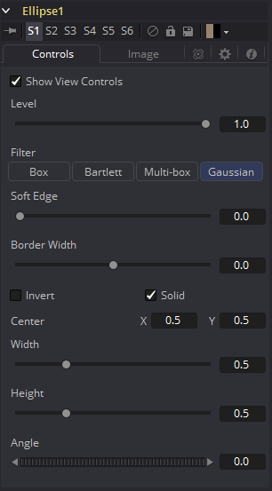
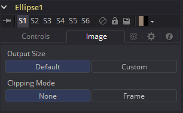

### Ellipse Mask [Elp] 椭圆遮罩

Ellipse遮罩对遮蔽圆形物体最有用。默认情况下是一个正圆，但可以对宽度、高度和角度进行单独控制，从而提供多种椭圆形状。

该遮罩工具的很多控件都可以在所有遮罩工具中找到通用的。这些控件在“Common Mask Controls 通用遮罩控件”中介绍。

#### Controls 控件

##### Level, Filter, Soft Edge and Border Width 级别、滤镜、柔边和边框宽度

请参阅“Common Mask Controls 通用遮罩控件”。

##### Width 宽度

该控件允许单独控制控制椭圆遮罩的宽度。除遮罩控件中的滑块之外，也可以交互式地在视图中使用指针拖动遮罩的宽（左或右边）。任何更改都会反映到该控件上。

##### Height

该控件允许单独控制控制椭圆遮罩的高度。除遮罩控件中的滑块之外，也可以交互式地在视图中使用指针拖动遮罩的高（顶或低边）。任何更改都会反映到该控件上。

##### Angle 角度

通过左右移动Angle控件来更改遮罩的旋转角度。可以通过提供的输入框来输入值。另外，通过拖动虚线小圆圈使用屏上控件也可以交互式地调整椭圆的旋转。

#### Image Tab 图像选项卡

请参阅“Common Mask Controls 通用遮罩控件”。

