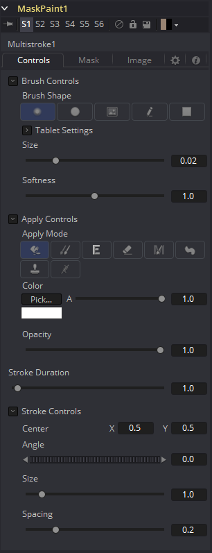
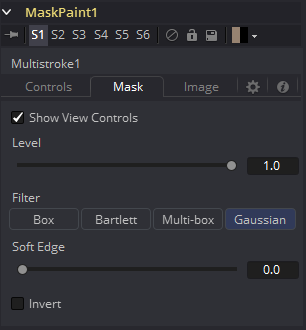
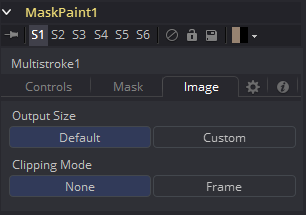

### Mask Paint [PnM]

Mask Paint工具允许直接在遮罩图像上使用鼠标指针作为笔刷绘制。除了常规的画笔笔画外，还可以应用基础图形和多边线样式笔画。

每个笔画都可以拥有持续整个工程的时长、单帧或场，或是任意数量的场。笔画在Timeline中都拥有独立的持续时间，所以可以非常方便地调整。另外，多笔画是一种更快但不可编辑的方法来做一些清理绘制任务的方法。

#### Controls 控件

因为Paint Mask工具基本上始于Paint工具完全相同的，参阅Paint和Rotoscoping一章来获取许多选项和功能的更多详细信息。它们之间唯一的区别在于，Paint Mask操作单通道的遮罩图像，所以并没有Channel Selector控件且所有色彩控件只有一个Alpha值。

#### Mask Tab 遮罩选项卡

#### Image Tab 图像选项卡

