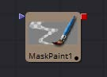

## 第十八章 Mask Tools 遮罩工具

- [Common Mask Controls 通用遮罩控件](./Common%20Mask%20Controls.md)
- [Bitmap Mask [Bmp] 位图遮罩](./Bitmap%20Mask%20[Bmp].md)
- [B-Spline Mask [BSp] B样条遮罩](./B-Spline%20Mask%20[BSp].md)
- [Ellipse Mask [Elp] 椭圆遮罩](./Ellipse Mask [Elp].md)
- [Mask Paint [PnM] 遮罩绘画](./Mask%20Paint%20[PnM].md)
- [Polygon Mask [Ply] 多边形遮罩](./Polygon%20Mask%20[Ply].md)
- [Ranges Mask [Rng] 范围遮罩](./Ranges%20Mask%20[Rng].md)
- [Rectangle Mask [Rec] 矩形遮罩](./Rectangle%20Mask%20[Rec].md)
- [Triangle Mask [Tri] 三角遮罩](./Triangle%20Mask%20[Tri].md)
- [Wand Mask [Wnd] 魔棒遮罩](./Wand%20Mask%20[Wnd].md)

<table id="img">
  <tr>
    <td rowspan="5"></td>
    <td></td>
    <td></td>
  </tr>
  <tr>
    <td></td>
    <td></td>
  </tr>
  <tr>
    <td></td>
    <td></td>
  </tr>
  <tr>
    <td></td>
    <td></td>
  </tr>
  <tr>
    <td></td>
  </tr>
</table>

