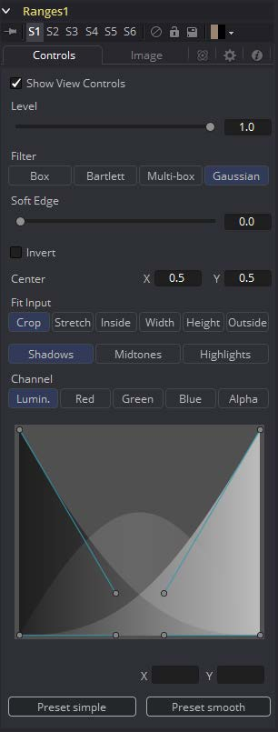
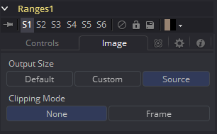

### Ranges Mask [Rng] 范围遮罩

与Bitmap遮罩类似，Range Mask允许流程中的图像作为工具或效果的遮罩。但它并不是从给定的通道创建一个简单基于亮度的遮罩，而是允许基于样条选择低、中、高范围，类似于Color Corrector。

#### Controls 控件

##### Level, Filter, Soft Edge and Border Width 级别、滤镜、柔边和边框宽度

请参阅“Common Mask Controls 通用遮罩控件”。

##### Shadows/Midtones/Highlights 阴影/中间值/高光

这些按钮用于选择哪个范围将被工具作为遮罩输出。白色像素代表会被考虑进范围的部分而黑色像素代表不被包含进范围。例如，选择Shadows会显示当作阴影的像素为白色而不为阴影的像素为黑色。中间灰度像素只在该范围中的一部分，不会受到该范围任何色彩调整的影响。

##### Channel 通道

该选项卡显示的Channel选择按钮可以用于从特定色彩通道的范围中提取遮罩。默认情况下，Fusion在检验色彩范围时使用亮度通道。

##### Spline Display 样条显示

范围的区域可以通过操纵样条手柄来选择。有四个带贝塞尔手柄的样条点。两个顶部手柄的表示阴影和高光范围的起始，而两个底部的表示范围的结束。贝塞尔手柄用于控制衰减。

中间值范围没有特定的控件，因为它的范围被认为是阴影和高光范围之间的空间。也就是说，在应用了低和高这招后，中间值也就是其余的部分。

Spline Display下方的X和Y文本控件可以用于为选中的贝塞尔点或手柄输入精准位置。

##### Presets 预设

这回将样条设置为两种常用的配置。Simple（简单）给了一种直白的线性权重选择，而Smooth（平滑）使用了更自然的衰减。

#### Image Tab 图像选项卡

请参阅“Common Mask Controls 通用遮罩控件”。

