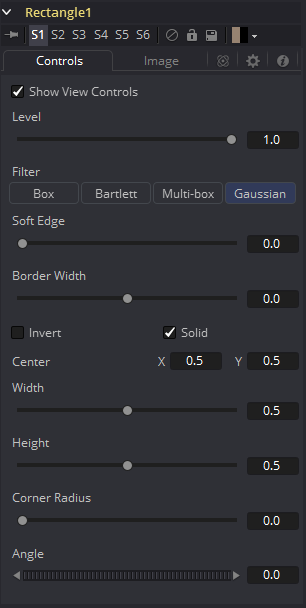
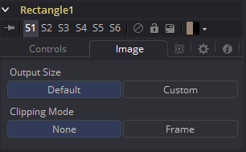

### Rectangle Mask [Rec]

Rectangle遮罩创建了一个简单的方形或矩形效果遮罩。

该遮罩工具的很多控件都可以在所有遮罩工具中找到通用的。这些控件在“Common Mask Controls 通用遮罩控件”中介绍。

#### Controls 控件

##### Level, Filter, Soft Edge and Border Width 级别、滤镜、柔边和边框宽度

请参阅“Common Mask Controls 通用遮罩控件”。

##### Width and Height 宽度和高度

使用这些控件可以独立地更改矩形效果遮罩的X和Y缩放。另外，你也可以在查看器中交互式地拖动矩形的边来调整尺寸。

##### Corner Radius 角半径

Corner Radius允许矩形遮罩的角圆弧化。值为0.0表示完全不进行圆弧化，也就是指该矩形拥有尖锐的角。值为1.0会向角应用最大的圆弧量。

##### Angle 角度

通过左右移动Angle控件更改效果遮罩的旋转角度。值也可以输入到提供的输入框中。另外通过拖动虚线小圆圈也可以交互式地使用屏上控件来调整矩形的旋转。

#### Image Tab 图像选项卡

请参阅“Common Mask Controls 通用遮罩控件”。

