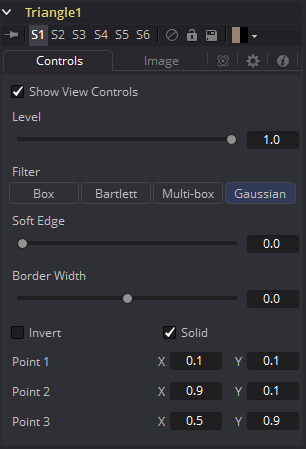
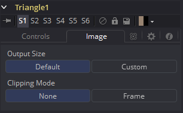

### Triangle Mask [Tri] 三角遮罩

Triangle遮罩的独特之处在于它没有Center、Size和Angle控件。与其他大多数遮罩类型不同，三角的所有三个点都可以连接到跟踪器或运动路径上。可以通过使用跟踪器和其他工具的路径来操纵三角形状来实现一些复杂的效果遮罩工作。

该遮罩工具的很多控件都可以在所有遮罩工具中找到通用的。这些控件在“Common Mask Controls 通用遮罩控件”中介绍。

#### Controls 控件

##### Level, Filter, Soft Edge and Border Width 级别、滤镜、柔边和边框宽度

请参阅“Common Mask Controls 通用遮罩控件”。

##### Point 1, Point 2, Point 3 点1、点2、点3

这些控件表示三角形三个角的位置。每个点都可以被发布（Publish）、连接至其他控件、添加路径动画或是绑定到跟踪器上。要完成这些工作，可以右键单击遮罩控件中的Position控件或直接查看器中的点。然后从上下文菜单中选择合适的选项。

#### Image Tab 图像选项卡

请参阅“Common Mask Controls 通用遮罩控件”。

