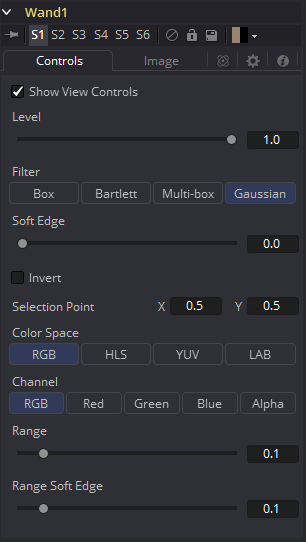
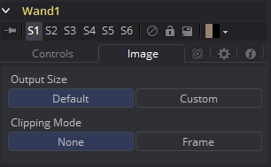

### Wand Mask [Wnd] 魔棒遮罩

Wand遮罩提供了基于魔棒方式选择为图像创建遮罩的能力，与传统2D绘图软件中找到的魔棒工具类似。与Bitmap遮罩一样，合成中的任何图像都可以用作遮罩的图像源。通常，默认的是最好用的，也就是输入的源图像是遮罩应用到的图像。

> **注意：**当向工具添加一个Wand遮罩时，查看器中会出现一个十字准星。该十字准星应该放置在图像中选择用于创建Wand遮罩的颜色。遮罩本身是通过检验选择点下的像素颜色并添加该点到遮罩中来创建的。遮罩之后扩大来检验选中点周围的的像素颜色。如果周围像素也有相同的颜色，则它们也被添加至遮罩。当没有连接的点位于遮罩的色彩范围内是，遮罩就会停止扩大。为该遮罩用作图像源的工具应该连接至流程中的Source（橙色）输入。与其他遮罩相同，Effect Mask（蓝色）输入用于结合该魔棒的结果和其他遮罩工具。

该遮罩工具的很多控件都可以在所有遮罩工具中找到通用的。这些控件在“Common Mask Controls 通用遮罩控件”中介绍。

#### Controls 控件

##### Level, Filter, Soft Edge and Border Width 级别、滤镜、柔边和边框宽度

请参阅“Common Mask Controls 通用遮罩控件”。

##### Selection Point 选择点

Selection Point是一组用于确定源图像从何处获取Wand遮罩派生它的初始色彩采样。该控件也可以在查看器中看到十字准星形式的。选择点可以手动放置、连接至跟踪器、路径或其他表达式。

##### Color Space 色彩空间

Color Space按钮组确定了用于为遮罩选择源色彩使用的色彩空间，Wand遮罩可以在RGB、YUV、HLS或LAB色彩空间中操作。

##### Channel 通道

Channel按钮组用于选择确定遮罩的颜色是来自图像的所有三个色彩通道、Alpha通道，还是只是一个独立的通道。

这些按钮的确切标签会取决于为Wand遮罩操作选择的色彩空间。如果色彩空间为RGB，那么选项会是R、G或B。如果是YUV，选项则是Y、U或V。

##### Range 范围

Range滑块控制会被包含进遮罩的原颜色周围的色彩范围。如果该值保留为0.0.那么只有与源色彩完全一样颜色才会被当做是遮罩的一部分。该值越高，那么越多相似的颜色会被考虑进遮罩的整个部分。

##### Range Soft Edge 范围柔边

Range Soft Edge确定了选中颜色的衰减范围。任何上述定义范围中的像素都会被当作100%在遮罩中。如果柔化范围设置为0.0，那么没有其他像素会被包含进遮罩中。增加柔化范围会增加接近但不是完全处于会被包含进遮罩的范围中的颜色数量。这些像素在遮罩中为半透明。

#### Image Tab 图像选项卡

请参阅“Common Mask Controls 通用遮罩控件”。

