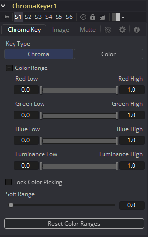
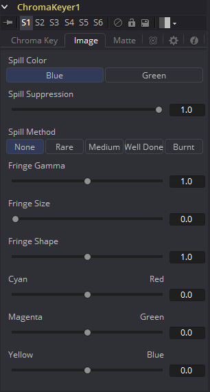
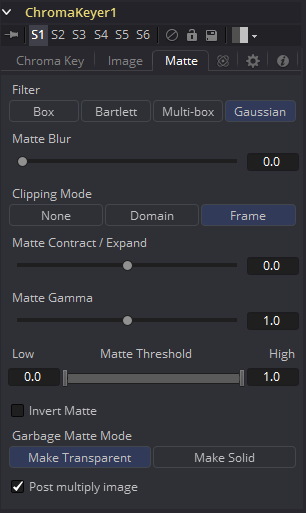

### Chroma Keyer [CKY] 色度键控

Chroma Keyer通过从场景中移除选定的颜色来为图像创建Alpha通道（蒙版）。与对蓝色和绿色键控特殊优化的Ultra Keyer不同，Chroma Keyer对任何颜色都同样适用。

#### Chroma Key Tab 色度键控选项卡

##### Key Type 键控类型

选择用于创建蒙版的类型。

- **Chroma 色度**
  根据所选颜色范围的RGB值来创建蒙版。
- **Color 颜色**
  基于所选颜色范围的色相创建蒙版。

#####  Color Range 颜色范围

这些范围控件会自动更新来表示当前的颜色选择。通过在流程中选中Chroma Keyer的节点，然后在监视器中拖动来选择用于创建蒙版的颜色。这些范围控制可用于微调选择，但通常只需在视图中选择颜色即可。

##### Lock Color Picking 锁定颜色拾取

勾选此复选框时，Fusion将阻止在视图中选择更多颜色而导致选定范围中的内容意外增长。为蒙版进行颜色选择后，最好勾选此复选框，而将工具中的其他控件都保持可编辑状态。

#####  Soft Range 柔化范围

该控件将柔化所选的颜色范围，以便在蒙版中包含额外的颜色。

#####  Reset Color Ranges 重置色彩范围

单击此按钮将重置Chroma Keyer的范围控件，丢弃所有颜色的选择。而其他滑块和控件均保持它们的数值。

#### Image Tab 图像选项卡

##### Spill Color 溢出颜色

使用这些按钮来选择用作所有溢出抑制技术基础的颜色。

##### Spill Suppression 溢出抑制

溢出通常是由于背景颜色通过alpha通道半透明区域透过引起的。在蓝幕或绿幕抠像的情况下，这通常会导致背景颜色在前景元素的须边变得明显。

溢出抑制会尝试消除须边的颜色。使用的过程是针对蓝幕或绿幕进行了优化；您可以从上面的控件中选择哪种颜色作为基础颜色。

当此滑块设置为0时，不会对图像应用溢出抑制。

##### Spill Method 溢出方法

选择用于对图像应用溢出抑制算法的强度。

- **None**
  不需要溢出抑制时，选择“None”。
- **Rare**
  去除极少溢出颜色，这是所有方法中最轻微的。
- **Medium**
  对绿幕最有效。
- **Well Done**
  对蓝幕最有效。
- **Burnt**
  对蓝幕最有效。此模式只能用于非常麻烦的镜头。很有可能在抠像后不得不添加较强的色彩校正，如用于肤色还原。

##### Fringe Gamma 须边伽马

此控件可用于调整抠像图像周围的须边或光晕的亮度。

##### Fringe Size 须边尺寸

扩大和缩小抠像图像周围的须边或光晕的大小。

##### Fringe Shape 须边形状

须边形状会强制将须边压向图像的外边缘或拉向须边的内边缘。当Fringe Size滑块的数值较大时，其效果最明显。

##### Cyan/Red, Magenta/Green and Yellow/Blue 青色/红色、品色/绿色和黄色/蓝色

使用这三个控件对图像的须边进行色彩校正。可用于校正仍包含原始背景颜色的半透明像素来匹配新背景。

#### Matte Tab 蒙版选项卡

##### Matte Blur 蒙版模糊

蒙版模糊使用标准的等速高斯模糊对蒙版的边缘进行模糊处理。值为零会产生一个锐利的、类似切口的硬边。较高的值会使蒙版应用更多的模糊。

##### Matte Contract/Expand 蒙版收缩/扩大

该滑块可缩小或增大遮罩的半透明区域。值大于0.0时扩大蒙版，值小于0.0时收缩蒙版。

此控件通常与Matte Blur结合使用，以获取蒙版的硬边并减少须边。由于此控件只影响半透明区域，因此不会影响硬边的蒙版。

##### Matte Gamma 蒙版伽马

蒙版伽马在半透明区域中可提高或降低蒙版的值。值越高，灰色区域越不透明；值越低，灰色区域越透明。蒙版的全黑或全白区域不受影响。

由于此控件只影响半透明区域，因此不会影响硬边的蒙版。

##### Matte Threshold 蒙版阈值

低于阈值下限的任意值在蒙版中变为黑色或透明。高于阈值上限的任意值在蒙版中变为白色或不透明。范围内的所有值都保持其相对透明度的值。

此控制通常用于消除蒙版中的salt and pepper noise（椒盐噪声）。

##### Invert Matte 反转蒙版

勾选此复选框时，由键控器创建的alpha通道将反转，从而导致所有透明区域不透明，所有不透明区域变透明。

##### Garbage Matte Mode 垃圾蒙版模式

垃圾蒙版是连接到工具节点上的Garbage Matte输入的遮罩工具或图像。垃圾蒙版直接应用于图像的Alpha通道。一般来说，垃圾蒙版是用来去除不需要的但不能抠的元素，例如麦克风和吊杆。它们还用于填充包含颜色抠像但希望保留的区域。

不同模式的垃圾蒙版不能在单个工具中混合。蒙版控制工具通常用于在键控器之后添加垃圾蒙版，其效果与应用于键控器的蒙版相反。

##### Make Transparent 变透明

选择此按钮可使垃圾蒙版变透明。

##### Make Solid 变实体

选择此按钮可使垃圾蒙版变实心。

##### Post Multiply Image 预乘图像

选择此选项可使键控器将图像的颜色通道与为图像创建的alpha通道相乘。此选项通常已启用，默认情况下处于启用状态。

如果取消勾选此复选框，则不能再将图像视为预乘图像，以将其与其他图像合并。使用合并工具的Subtractive（减性）选项而不是Additive（加性）选项。

有关详细信息，请参阅“Merge”合并工具文档。

