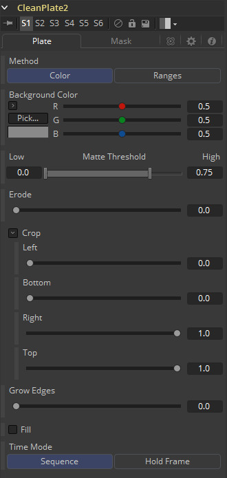
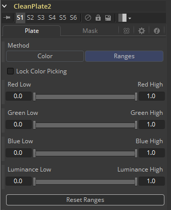
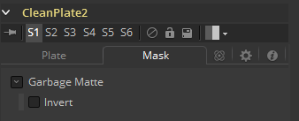

### Clean Plate [CPl]

Clean plate工具是一种用于生成绿屏或蓝屏图像来平滑照明差异预抠像工具，以便在之后抠像时可以在不抑制或修剪蒙版的情况下抠出精细的细节。

#### Plate Tab Plate选项卡

##### Method 方法

- **Color 色彩：**使用差异方法替换颜色，通过单击选择拖动单击到图像。
- **Ranges 范围：**使用色度范围方法来分离背景色。

##### Matte Threshold 蒙版阈值

低于阈值下限的任意值在蒙版中变为黑色或透明。高于阈值上限的任意值在蒙版中变为白色或不透明。范围内的所有值都保持其相对透明度的值。此控件通常用于消除蒙版中的salt and pepper noise（椒盐噪声）。

##### Erode 收缩

减小屏幕区域的大小。

##### Crop 裁剪

从图像的边缘裁剪。

##### Grow Edges 增长边缘

扩展对象边缘的颜色。

##### Fill 填充

使用周围屏幕颜色来填充剩余的孔。

##### Time Mode 时间模式

- **Sequence 序列：**每一帧会生成一个新的空背景。
- **Hold Frame 定帧：**将空背景固定在某一帧。

#### Mask Tab 遮罩选项卡

##### Garbage Mask 垃圾遮罩

垃圾遮罩可以在增长边缘或填充剩余孔之前应用于清除区域。

##### Invert 反转

使用遮罩的透明部分来清除图像。

