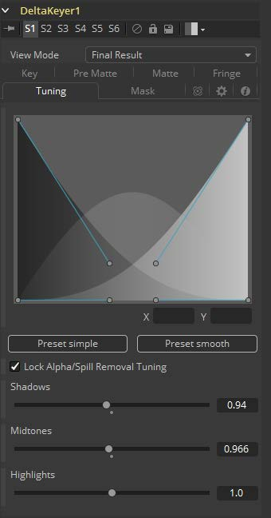

### Delta Keyer [DK] 色差键控

Delta Keyer是一款经典的色差键控器，具有很多用于调整蒙版和将主体从蓝屏或绿屏中分离出来的功能和控件。

它包含多个键控系统，键控（Key）选项卡是主差异键控器，预蒙版（Pre Matte）是一个预处理空背景来平滑屏幕颜色。调整（Tuning）、须边（Fringe）和蒙版（Matte）完成抠像过程。

##### How to Key 如何抠像

使用Background Color上的Pick（拾取）按钮从图像中选择蓝色或绿色的屏幕颜色。按住Alt键或Option键（Mac）同时单击并拖动Pick拾取点，它将从上游节点的图像中拾取颜色，并使抠像不再闪烁。

预蒙版（Pre Matte）是空背景生成器，它可以平滑屏幕的颜色，并通过框选屏幕颜色的区域，微调Erode将扩大预蒙版，使其不修剪图像的主体。

##### 输入项

- Input 图像输入
- Garbage Matte 垃圾蒙版
- Clean Plate 空背景
- Effect mask 效果遮罩
- Solid Matte 实心蒙版

##### View Mode 查看模式

空间的顶部是View Mode，默认情况下显示为Final Result。可以通过更改它来查看键控过程中各阶段的输出。

- **Pre Matte 预蒙版**将显示预蒙版键控的输出。
- **Matte 蒙版**将在实体与垃圾遮罩组合之前显示抠像的alpha通道。
- **Tuning Ranges 调试范围**将显示图像的暗部、中间调和亮部范围。暗部位于红色通道，中间调位于绿色通道，亮部位于蓝色通道。
- **Status 状态**显示信息来指示实心、透明或介于两者之间的区域。它还显示受蒙版调整影响的区域（例如阈值或收缩/扩大），以及受实体遮罩影响的区域。
- **Intermediate Result 中间结果**是原始源图像的颜色通道与最终的蒙版相结合。这可以进一步与DeltaKeyer结合使用。
- **Final Result 最终结果**是带有溢出抑制的最终键控图像，可合并到场景。

#### Key Tab 键控选项卡

##### Background Color 背景颜色

这是蓝屏或绿屏的颜色，即变为无Alpha黑色的键控颜色。使用Background Color上的Pick（拾取）按钮从图像中选择蓝屏或绿屏的颜色。按住Option键（Alt键）同时单击并拖动拾取点，它将从上游图像中拾取颜色，从而使抠像不闪烁。

##### Pre-Blur 预模糊

在生成Alpha通道之前应用模糊。这有助于在源图像中增强某些类型的噪声、边缘和伪影。

##### Gain 增益

增加背景颜色的影响。这将导致背景区域颜色变得更加透明。

##### Balance 平衡

通过比较由背景颜色确定的主通道与其他两个通道之间的差异来执行抠像，并保持平衡确定其他两个通道的比例。值为0将使用其他两个通道中的最小值，其中值为1将使用最大值，值为0.5将使用每个值的一半。

##### Lock Alpha/Spill Removal Color Balance Reference 锁定Alpha/消除溢色平衡参考

解锁此选项允许在生成alpha时以及在确定要从图像中减去多少背景颜色时，都能使用不同的颜色参考。

##### Color Balance Reference 色彩平衡参考

可用于调整可能会降低背景色纯度和饱和度的照明或白平衡。在生成抠像alpha和确定背景色减去的数量时，可以根据中性色对象的参考应用校正，而不改变被减去的背景色。

#### Pre Matte Tab 预蒙版选项卡

##### Soft Range 柔化范围

柔化范围将扩展所选颜色的范围并辗轧屏幕颜色。

##### Erode收缩

将收缩预蒙版的边缘，因此边缘细节不会被修剪。

##### Blur模糊

这将柔化预蒙版的边缘。

##### PreMatte Range 预蒙版范围

这些范围控制会自动更新来表示当前的颜色选择。通常，显示控制不必打开即可显示这些控制。通过在流程中选择“Ultra Keyer”工具节点并在检视器中拖动来选择用于创建蒙版色的颜色。这些范围控制可用于微调选择，但通常只需在显示中选择颜色即可。

##### Lock Color Picking 锁定颜色拾取

选中此复选框时，通过从视图中选择更多颜色，Fusion将防止所选范围的意外增长。一旦对蒙版进行了颜色选择后，最好选中此复选框。该工具中的所有其他控制都保持可编辑状态。

##### Reset Pre Matte Ranges 重置预蒙版范围

这将会通过重置范围来放弃所有颜色选择，但会保留所有其他滑块和控制值。

#### Matte Tab 蒙版选项卡

##### Threshold 阈值

低于阈值下限的任意值在蒙版中变为黑色或透明。高于阈值上限的任意值在蒙版中变为白色或不透明。范围内的所有值都保持其相对透明度的值。

##### Restore Fringe 恢复须边

这样可以恢复键控主体周围的蒙版边缘。通常为了得到抠像，您头发的边缘会被剪掉，恢复须边将带回这些边缘，同时保持蒙版为实体。

##### Erode/Dilate 收缩/扩大

将会扩大或收缩蒙版。

##### Blur模糊

柔化蒙版。

##### Clean Foreground 清理前景

将填充蒙版半透明的区域。

##### Clean Background清理背景

将修剪蒙版底部深色区域。

##### Replace Mode 替换模式

确定蒙版调整将如何使颜色恢复到图像。

- **None** 没有颜色替换，蒙版处理不会影响颜色。
- **Source**  是来自未抠像的原始颜色。
- **Hard Color** 是纯色。
- **Soft Color** 是纯色，根据最初移除背景色的多少来加量。

##### Replace Color 替换颜色

与“Hard Color”和“Soft Color”一起使用的颜色替换模式。

#### Fringe Tab 须边选项卡

##### Spill Suppression 溢出抑制

溢出通常是由于背景颜色通过alpha通道半透明区域传输引起的。在蓝色或绿色屏幕抠像的情况下，这通常会导致背景颜色在前景元素的须边变得明显。

溢出抑制尝试消除须边的颜色。使用的过程是针对蓝屏或绿屏进行了优化；您可以从上面的控制中选择哪种颜色作为基础颜色。

当此滑块设置为0时，不会对图像应用溢出抑制。

##### Spill Method 溢出方法

这将选择用于对图像应用溢出抑制的算法强度。

- **None** 当不需要溢出抑制时，则选择“None”。
- **Rare** 这几乎没有去除溢出的颜色，这是所有方法中最轻的。
- **Medium** 这对绿屏最有效。
- **Well Done** 这对蓝屏最有效。
- **Burnt** 这对蓝色最有效。此模式只能用于非常麻烦的镜头。

##### Fringe Gamma 须边Gamma

此控制可用于调整抠像图像周围的须边或光晕的亮度。

##### Fringe Size 须边尺寸

这会扩大和缩小抠像图像周围的须边或光晕的大小。

##### Fringe Shape 须边形状

须边形状会强制将须边压向图像的外边缘或拉向须边的内边缘。当须边尺寸滑块的数值较大时，其效果最明显。

##### Cyan/Red, Magenta/Green and Yellow/Blue 青色/红色、品色/绿色和黄色/蓝色

使用这三个控制对图像的须边进行色彩校正。

这对于校正仍包含原始背景颜色的半透明像素来匹配新背景非常有用。

#### Tuning Tab 调试标签

##### Range controls 范围控制

这将定义了图像的暗部、中间调和亮部区域的颜色范围。此样条线控制可轻松调整每个暗部和亮部色调映射的色调范围。

“Preset Simple”将范围设置为线性。“Preset Smooth”设置范围的平滑色调渐变。

##### Lock Alpha/Spill Removal Tuning 锁定Alpha/溢色移除调整

解锁此选项允许在生成alpha时以及在确定要从图像中减去多少背景颜色时，都能使用不同的调整。

- **Shadows 暗部**
  在背景较暗的区域中调整抠像的强度。
- **Midtones 中间调**
  在背景中间调的区域中调整抠像的强度。
- **Highlights 亮部**
  在背景较亮的区域中调整抠像的强度。

#### Mask Tab 遮罩选项卡

##### Solid Mask 实体遮罩

##### Solid Source Alpha 实体源Alpha

用于将源图像中现有的Alpha合并到实体遮罩中。

- **Ignore** 不合并源图像中的Alpha。
- **Add** 源图像Alpha的实体区域将在实体遮罩中变实。
- **Subtract** 源图像Alpha的透明区域将在实体遮罩中变为透明。

##### Solid Replace Mode 实体替换模式

这将确定实体遮罩如何使颜色恢复到图像。

- **None** 没有颜色替换，实体遮罩不会影响颜色。
- **Source** 是来自未抠像的原始颜色。
- **Hard Color** 是纯色。
- **Soft Color** 是纯色，根据最初移除背景色的多少来加量。

##### Solid Replace Color 实体替换颜色

与“Hard Color”和“Soft Color”一起使用的颜色替换模式。

**Invert 反转**

将反转实体遮罩，然后将其与源Alpha组合。

##### Garbage Mask 垃圾遮罩

**Invert 反转**

通常垃圾遮罩的实体区域将清除图像。反转时，此遮罩的透明区域将清除图像。