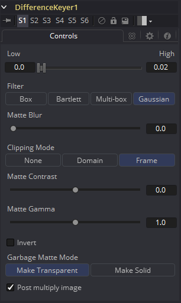

### Difference Keyer [DfK] 差异键控

差异键控是基于两个图像之间的差异生成蒙版的过程。差异抠像使用两张输入图像，其中一张包含带有背景的主体，另一张没有包含主体的背景。

差异键控工具非常灵敏，虽然乍一看这个过程听起来很合理，但每次拍摄时相机位置的细微变化通常都很难使用此方法提取高精度的Alpha通道。想象一下尝试在砖墙前抠出烟雾，并使用砖墙的空背景作为您的差异输入，这种尝试是徒劳的。在这种抠像方法中，墙壁的部分结构将始终可见。相反，差异键控器通常用于生成粗糙的蒙版，并与其他工具结合使用以产生更细致的蒙版。

#### Controls 控件

##### Threshold High and Low 阈值高和低

此滑块通过定义图像之间的差异值范围来创建蒙版。低于阈值下限的差异在蒙版中变为黑色。高于阈值上限的任何差异都在蒙版中将变为白色（纯色）。介于两者之间范围内的差异值将创建灰度蒙版。

##### Matte Blur 蒙版模糊

这会使用标准的等速高斯模糊对蒙版的边缘进行模糊处理。如果值为零，则会产生一个锐利的、类似切口的硬边。值越高，越模糊。

##### Matte Contrast 蒙版对比度

“蒙版对比度”滑块可更改蒙版亮度值的查找表曲线。这样将会在滑块的低端创建蒙版软裁剪，并在滑块值较高时创建蒙版的硬边扩展。

##### Matte Gamma 蒙版Gamma

蒙版Gamma在半透明区域中可提高或降低蒙版的值。值越高，灰色区域越不透明；值越低，灰色区域越透明。蒙版的全黑或全白区域不受影响。

**Invert 反转**

勾选此复选框将反转蒙版，导致所有透明区域不透明，所有不透明区域变透明。

##### Garbage Matte Mode 垃圾蒙版模式

垃圾蒙版是连接到工具节点上的“垃圾蒙版”输入的遮罩工具或图像。垃圾蒙版直接应用于图像的Alpha通道。一般来说，垃圾蒙版是用来去除不需要的但不能抠的元素，例如麦克风和吊杆。它们还用于填充包含颜色抠像但希望保留的区域。

不同模式的垃圾蒙版不能在单个工具中混合。蒙版控制工具通常用于在键控器之后添加垃圾蒙版，其效果与应用于键控器的蒙版相反。

##### Make Transparent 变透明

选择此按钮可使垃圾蒙版变透明。

##### Make Solid 变实体

选择此按钮可使垃圾蒙版变实体。

##### Post Multiply Image 预乘图像

选择此选项可使键控器将图像的颜色通道与为图像创建的alpha通道相乘。此选项通常已启用，默认情况下处于启用状态。

如果取消勾选此复选框，则不能再将图像视为预乘图像，以将其与其他图像合并。使用合并工具的“Subtractive（减法）”选项而不是“Additive（加法）”选项。

有关详细信息，请参阅“Merge ”合并工具文档。