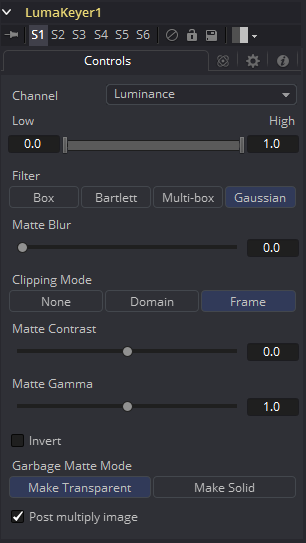

### Luma Keyer [LKy]

Luma Keyer工具使用图像的整体亮度来创建Alpha通道。当此工具第一次被创建时，它仅在图像的亮度通道上使用，但后来它已经发展到可以从Fusion所掌握的几乎所有通道中获取蒙版。在某些方面，现在将此工具称为“Channel Keyer（通道键控器）”更为准确。

#### Controls 控件

##### Channel 通道

使用此下拉列表选择用于创建蒙版的颜色通道。可以从红色、绿色、蓝色、Alpha、色相、亮度、饱和度和深度（Z缓冲区）通道中选择。

##### Threshold High and Low 阈值高和低

此滑块通过定义图像中的亮度值范围来创建蒙版。低于阈值下限的任意值在蒙版中变为黑色或透明。高于阈值上限的任意值在蒙版中变为白色（纯色）。该范围内的所有值都将创建灰度蒙版。

##### Matte Blur 蒙版模糊

蒙版模糊使用标准的等速高斯模糊对蒙版的边缘进行模糊处理。如果值为零，则会产生一个锐利的、类似切口的硬边。值越高，应用于蒙版的模糊就越多。

##### Matte Contrast 蒙版对比度

对比度滑块可更改蒙版亮度值的查找表曲线。这样将会在滑块的低端创建蒙版软裁剪，并在滑块值较高时创建蒙版的硬边扩展。

##### Matte Gamma蒙版Gamma

蒙版Gamma在半透明区域中可提高或降低蒙版的值。值越高，灰色区域越不透明；值越低，灰色区域越透明。蒙版的全黑或全白区域不受影响。

**Invert 反转**

打开时，蒙版会反转，导致所有透明区域不透明，所有不透明区域变透明。

##### Garbage Matte Mode 垃圾蒙版模式

垃圾蒙版是连接到工具节点上的“垃圾蒙版”输入的遮罩工具或图像。垃圾蒙版直接应用于图像的Alpha通道。一般来说，垃圾蒙版是用来去除不需要的但不能抠的元素，例如麦克风和吊杆。它们还用于填充包含颜色抠像但希望保留的区域。

不同模式的垃圾蒙版不能在单个工具中混合。蒙版控制工具通常用于在键控器之后添加垃圾蒙版，其效果与应用于键控器的蒙版相反。

##### Make Transparent 变透明

选择此按钮可使垃圾蒙版变透明。

##### Make Solid 变实体

选择此按钮可使垃圾蒙版变实体。

##### Post Multiply Image 预乘图像

选择此选项可使键控器将图像的颜色通道与为图像创建的alpha通道相乘。此选项通常已启用，默认情况下处于启用状态。

如果取消选中此复选框，则不能再将图像视为预乘图像，以将其与其他图像合并。使用合并工具的“Subtractive（减法）”选项而不是“Additive（加法）”选项。

有关详细信息，请参阅“Merge ”合并工具文档。