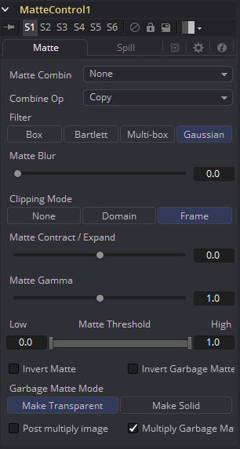
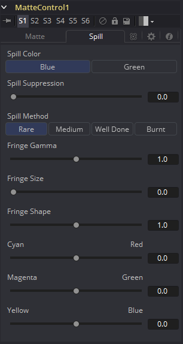

### Matte Control [Mat] 蒙版控制

键控工具通常用于在尚未有alpha通道的图像上创建Alpha通道。蒙版控制工具用于操作现有的Alpha通道或通过动态遮罩手动创建一个通道。

蒙版控制工具也有一个“前景图像”输入。使用此工具可以将颜色通道或Alpha通道从前景复制到背景，或将两个图像中的alpha通道合并。

#### Matte Tab 蒙版选项卡

##### Matte Combine蒙版组合

蒙版控制工具可以将来自前景输入中的图像alpha通道或颜色通道与背景图像中的组合起来。使用此菜单选择要应用的操作。默认设置为“None（无）”，表示不执行任何操作。

- **None**
  这将导致忽略前景图像。
- **Combine Red**
  这将FG（前景）红通道与BG（背景）alpha通道合并。
- **Combine Green**
  这将FG（前景）绿通道与BG（背景）alpha通道合并。
- **Combine Blue**
  这将FG（前景）蓝通道与BG（背景）alpha通道合并。
- **Combine Alpha**
  这将FG（前景）alpha通道与BG（背景）alpha通道合并。
- **Solid**
  这会导致BG（背景） alpha通道变得完全不透明。
- **Clear**
  这会导致BG（背景）alpha通道变得完全透明。

##### Combine Operation 组合运算

使用此菜单可选择用于将前景通道与背景相结合的方法。

- **Copy**
  这将在背景Alpha上复制前景源，覆盖背景中的任何现有的Alpha通道。
- **Add**
  这会将前景源添加到背景Alpha。
- **Subtract**
  这将从背景Alpha中减去前景源。
- **Inverse Subtract**
  这将从前景源中减去背景Alpha。
- **Maximum**
  这将比较前景源和背景Alpha并从具有最高值的像素中取值。
- **Minimum**
  这将比较前景源和背景Alpha并从具有最低值的像素中取值。
- **And**
  这将对两个值执行逻辑AND（和）。
- **Or**
  这将对值执行逻辑OR（或）。
- **Merge Over**
  这将在背景Alpha通道上合并前景源通道。
- **Merge Under**
  这将前景源通道合并到背景Alpha通道之下。

##### Filter 滤镜

模糊蒙版时使用的滤镜选择。

- **Box Blur:** 该选项对整个图像应用方形模糊效果。这种方法比高斯模糊速度快，但产生的结果质量较低。
- **Bartlett:** Bartlett应用了一种更精细的抗锯齿的模糊滤镜。
- **Multi-box:** Multi-Box使用多层方形滤镜来近似高斯形状。通过适量的次数（例如4次），可以获得高质量的模糊，通常比高斯滤镜快并且没有任何“振铃”。
- **Gaussian:** 高斯应用平滑，对称模糊滤镜，使用复杂的等时高斯近似算法。在极端情况下，此算法可能会出现“振铃”现象；有关此问题的讨论，请参阅下文。此模式是默认的滤镜方式。

##### Matte Blur 蒙版模糊

这会使用标准的等速高斯模糊对蒙版的边缘进行模糊处理。如果值为零，则会产生一个锐利的、类似切口的硬边。值越高，应用于蒙版的模糊就越多。

##### Matte  Contract/Expand蒙版收缩/扩大

这会缩小或增大蒙版，来排除某些键控图像或包括其周围的某些区域。大于0.0的值时扩大蒙版，小于0.0的值时收缩蒙版。

##### Matte Gamma蒙版Gamma

这会提高或降低半透明区域中蒙版的值。值越高，灰色区域越不透明；值越低，灰色区域越透明。蒙版的全黑或全白区域不受影响。

##### Matte Threshold蒙版阈值

低于阈值下限的任意值在蒙版中变为黑色或透明。高于阈值上限的任意值在蒙版中变为白色或不透明。范围内的所有值都保持其相对透明度的值。

##### Invert Matte 反转蒙版

选中此复选框时，图像的alpha通道将反转，从而导致所有透明区域不透明，所有不透明区域变透明。

##### Garbage Matte 垃圾蒙版

垃圾蒙版是连接到工具节点上的“垃圾蒙版”输入的遮罩工具或图像。垃圾蒙版直接应用于图像的Alpha通道。一般来说，垃圾蒙版是用来去除不需要的但不能抠的元素，例如麦克风和吊杆。它们还用于填充包含颜色抠像但希望保留的区域。

不同模式的垃圾蒙版不能在单个工具中混合。蒙版控制工具通常用于在键控器之后添加垃圾蒙版，其效果与应用于键控器的蒙版相反。

- **Make Transparent**
  选择此按钮可使垃圾蒙版变透明。
- **Make Solid**
  选择此按钮可使垃圾蒙版变实体。

##### Post Multiply Image

选择此选项可使键控器将图像的颜色通道与为图像创建的alpha通道相乘。此选项通常已启用，默认情况下处于启用状态。

如果取消选中此复选框，则不能再将图像视为预乘图像，以将其与其他图像合并。使用合并工具的“Subtractive（减法）”选项而不是“Additive（加法）”选项。

##### Multiply Garbage Matte

选中时，图像的红色、绿色和蓝色通道的值将与垃圾蒙版输入相乘。

有关详细信息，请参阅“Merge ”合并工具文档。

#### Spill Tab 溢出选项卡

##### Spill Color 溢出颜色

使用这些按钮选择用作所有溢出抑制技术基础的颜色。

##### Spill Suppression 溢出抑制

溢出通常是由于背景颜色通过alpha通道半透明区域传输引起的。在蓝色或绿色屏幕抠像的情况下，这通常会导致背景颜色在前景元素的须边变得明显。

溢出抑制尝试消除须边的颜色。使用的过程是针对蓝屏或绿屏进行了优化；您可以从上面的控制中选择哪种颜色作为基础颜色。

当此滑块设置为0时，不会对图像应用溢出抑制。

##### Spill Method 溢出方法

这将选择用于对图像应用溢出抑制的算法强度。

- **None**
  当不需要溢出抑制时，则选择“None”。
- **Rare**
  这几乎没有去除溢出的颜色，这是所有方法中最轻的。
- **Medium**
  这对绿屏最有效。
- **Well Done**
  这对蓝屏最有效。
- **Burnt**
  这对蓝色最有效。此模式只能用于非常麻烦的镜头。

##### Fringe Gamma 须边Gamma

此控制可用于调整抠像图像周围的须边或光晕的亮度。

##### Cyan/Red, Magenta/Green and Yellow/Blue青色/红色、品色/绿色和黄色/蓝色

使用这三个控制对图像的须边进行色彩校正。这对于校正仍包含原始背景颜色的半透明像素来匹配新背景非常有用。

##### Fringe Size 须边尺寸

这会扩大和缩小抠像图像周围的须边或光晕的大小。

##### Fringe Shape 须边形状

须边形状会强制将须边压向图像的外边缘或拉向须边的内边缘。当须边尺寸滑块的数值较大时，其效果最明显。