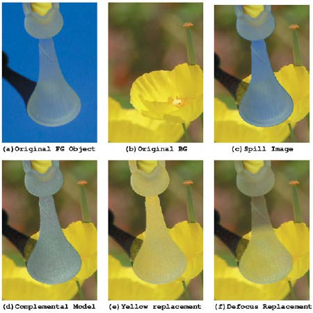

### Primatte [Pri]

Primatte 是Fusion的一个高级键控系统。它是由美国加利福尼亚州洛杉矶，IMAGICA Corp. 美国的公司发行和许可的。Primatte是由日本东京IMAGICA Corp. 公司开发的。

#### External Inputs 外部输入

**Orange (required)橙色(必选)** 主要输入。与Fusion中的其他工具不同，这实际上是“前景”输入，因为它包含要抠像的图像，或者换句话说，要在合成的前景中分层，将要抠像的图像连接到此输入。

**Green (optional)绿色(可选):** 在Primatte中，这是背景输入。它包含合成的背景层。如果未连接任何图像，Primatte将只输出抠像元素。在此处连接一张图像来利用Primatte的高级边缘混合选项。

**Pink (optional)粉色(可选):** 替换图像的输入。

**White (optional)白色(可选):** 垃圾蒙版。

**Blue (optional)蓝色(可选):** 遮罩输入。

> **注意：**如果背景输入已连接，但替换图像输入未连接，那么“图像替换”模式将使用背景图像，并且抠像前景将放置在该背景上。如果已连接替换图像输入，然后将其用于图像替换，并且抠像的前景仍将放置在来自背景输入的图像上。

#### Primatte Tab Primatte选项卡

##### Lock Color Picking 锁定颜色拾取

调整完抠像后，激活此按钮。这样可以防止通过单击视图意外更改设置。

##### Auto Compute 自动计算

这很可能是您开始为自己的素材抠像时要按下的第一个按钮。然后Primatte自动分析原始前景图像并确定底色并将其设置为主要底色。然后利用该信息，分析原始的前景图像并使用新的Primatte V5前景检测程序来确定前景区域。然后在内部使用新确定的前景区域执行“清除FG（前景）噪声”操作，并为中间和外部多面体确定更理想的形状。然后使用生成的多面体渲染合成。这不会自动使用“调整照明”功能，因为必须在单独的操作中选择它。

##### Select Background Color 选择背景颜色

允许用户选择背景色，这意味着通过颜色拾取器在视图中键控操作。它使用了传统的Primatte方法，即选择采样的背景屏幕颜色，在色轮上沿相反方向上投射一条线，并生成可以代表FG对象的人工像素。然后在内部使用人工生成的前景像素执行清除FG噪声的操作，并创建中间和外部多面体的形状。然后使用生成的多面体渲染合成。这不会自动使用调整照明功能，因为必须在单独的操作中选择它。

##### Clean Background Noise 清除背景噪声

有助于去除暗屏区域中的任何白色区域（“噪声”）或在第一次采样中没有被拾取的蓝色调。在这些区域中移动光标，同时按住鼠标左键来采样这些白色的噪声区域。

##### Clean Foreground Noise清除前景噪声

如果在大多数为白色前景的对象中间存在暗部区域，也就是说如果键控操作不是100%在目标前景的某个部分，则使用与“清除背景噪声”相同的技术来清除前景，但这次是在前景区域中采样暗部像素，直到该区域尽可能的白。

##### Spill Sponge 溢出海绵

去除物体上颜色溢出的最快方法是使用溢出海绵对溢出区域进行采样。通过将光标定位在蓝色像素上并选择它，蓝色将从所选颜色区域消失，并被更自然的颜色替换。应使用“Fine Tuning(微调)”标签下的工具或使用“Spill溢出 (-)”功能执行其他溢出清除。这两个都在本手册中作了进一步的说明。

##### Matte Sponge 蒙版海绵

有时在Primatte操作中，100％的前景区域（全白）会变得稍微透明（灰色）。您可以使用“Matte Sponge(蒙版海绵)”清除那些透明的区域。单击透明像素，它们将成为100％的前景。所有的溢出抑制信息将保持完整。

##### Restore  Detail 恢复细节

选择此模式后，在图像窗口中采样完全透明的背景区域将变为半透明。此操作对于恢复丢失的头发细节、薄缕轻烟等非常有用，它会稍微收缩小的多面体。

##### Make Foreground Transparent 前景变透明

选择此模式后，在图像窗口中采样的不透明前景颜色区域将变得略微半透明。此操作对于前景对象的微调非常有用，否则前景对象将100％被烟雾或云覆盖。它只能在特定颜色上使用一次。为了更灵活地细化颜色区域并能够生成多采样，您应该使用“Matte蒙版(-)”工具。它会略微扩展中等多面体。

##### Spill(+) 溢出(+)

色彩溢出将以一个Primatte的增量为单位返回到采样像素颜色（以及所有类似的颜色）。此工具可以用来将采样颜色更多地移向原始前景图像中颜色的方向。它可用于取消“Spill溢出 (-)”步骤。该工具会在所采样的颜色区域中使Primatte大多面体减少。

##### Spill(-) 溢出(-)

色彩溢出将从采样像素颜色（以及所有类似的颜色）中以一个Primatte增量为单位移除。如果溢出颜色仍然存在，请使用此操作模式工具的另一次单击将消除更多的颜色溢出。继续使用此工具，直到已从采样颜色区域中移除所有颜色溢出。该工具在采样的颜色区域扩展了Primatte大多面体。

##### Matte(+) 蒙版(+)

对于采样像素颜色（以及所有类似的颜色），蒙版将以一个Primatte增量为单位变得更加不透明。如果蒙版仍然太半透明或太薄，使用此操作模式工具再次单击，将使采样颜色区域更加不透明。这可用来加厚烟雾或使阴影变暗以匹配背景图像中的阴影。它只能对原始前景图像上颜色区域的密度进行这些调整。它可用于取消“Matte蒙版(-)”步骤。该工具会在所采样的颜色区域中使Primatte中等多面体减少。

##### Matte(-) 蒙版(-)

对于采样像素颜色（以及所有类似的颜色），蒙版将以一个Primatte增量为单位变得更加透明。如果蒙版仍然不太透明，使用此操作模式工具再次单击将使采样颜色区域更加透明。这可用于减少烟雾或使阴影变薄以匹配背景图像中的阴影。该工具扩展了采样颜色区域中的Primatte中等多面体。

##### Detail(+) 细节(+)

对于采样像素颜色（以及所有类似的颜色），以一个Primatte增量为单位，前景细节将变得不太明显。如果仍然有太多细节，再次单击使用此操作模式工具将使更多内容消失。这可以用来消除合成中的烟雾或头发。在可见的地方采样，它就会消失。这是为了将颜色区域移动到100％背景区域。它可用于取消“Detail细节(-)”步骤。该工具在采样的颜色区域扩展Primatte小多面体。

##### Detail(-) 细节(-)

当选择此操作模式时，前景细节将以一个Primatte增量为单位对采样像素颜色（以及所有类似的颜色）变得更明显。如果仍然缺少细节，则使用此操作模式工具再次单击将使细节内容更加明显。这可用于恢复失去的烟雾或一缕头发。采样刚才消失的烟雾或头发并将其恢复可见的位置。这是为了恢复被移至100％背景区域的颜色区域。如果前景图像的拍摄条件不理想，可能会产生背景噪声。这个工具会在采样的颜色区域使Primatte小多面体减少。

##### Algorithms 算法

- **Primatte:** Primatte算法模式可提供最佳结果，并提供支持纯色和补色溢出抑制方法。该算法使用三个多面体（如本文档后面所述）以分离3D RGB色彩空间。它也是默认的算法模式并且由于计算量大，可能需要最长的渲染时间。
- **Primatte RT:** Primatte RT是最简单的算法，因此也是最快的算法。它仅使用单个平面来分离3D RGB色彩空间（如本文档后面所述），因此无法像上述Primatte算法那样小心地从背景屏幕中分离出前景。Primatte RT算法的另一个缺点是它不能很好地处理饱和度较低的背景色，也不支持补色溢出抑制方法。
- **Primatte RT+:** Primatte RT+介于上述两种选项之间。它使用六个平面分色算法（如本文档后面所述），并将在质量和性能方面在其他两种算法之间传递结果。Primatte RT+算法的另一个缺点是，它不能很好地处理饱和度较低的背景色，也不支持补色溢出抑制方法。

##### Hybrid Rendering 混合渲染

在对背景屏幕颜色进行采样并发现前景对象的边缘看起来非常不错之后，有时您会发现前景对象的某个区域是透明。这是因为前景包含的颜色接近背景屏幕颜色。当使用“清除FG噪声”操作模式移除该透明度时，前景对象的边缘会拾取一个接近背景屏幕颜色的须边，并且在不牺牲图像上其他地方质量的情况下很难移除。混合渲染模式在内部创建两个键控操作：主体和边缘。边缘操作是在没有任何须边效果的情况下，围绕前景对象获得最佳边缘而优化的。主体操作用于处理前景对象中的透明度，生成的蒙版是通过组合这两个蒙版（主体和边缘）创建的，方法是在主体操作中模糊并收缩前景对象，然后将其与在边缘操作中创建的蒙版组合。

用户首先使用智能的“选择BG颜色”模式（或其他任何Primatte背景屏幕检测方法）对主要前景区域进行抠像，直到在前景对象周围具有良好边缘的情况下获得良好结果。然后用户选择“混合渲染”按钮并选择“清除FG噪声”操作模式。然后对透明区域进行采样时，Primatte V5混合渲染模式将在内部执行“主体/边缘”操作。这将导致最终的合成，在前景对象周围具有良好的边缘，同时仍保留前景对象中透明的区域。

- **Hybrid Blur 混合模糊**
  模糊主体已自动生成的蒙版。
- **Hybrid Erode 混合收缩**
  该滑块允许用户调整应用于混合蒙版的收缩量。如果已激活“混合蒙版”按钮，则可以查看结果。

##### Adjust Lighting 调整照明

在应用“调整照明”操作之前，必须使用上述方法其中一个来确定背景屏幕颜色。

执行其中一个操作后，用户单击“调整照明”按钮。Primatte将在内部生成一个没有前景对象的人工背景屏幕，并使用它生成在前景对象后面具有均匀照明背景屏幕的预处理图像。

默认设置应检测“调整照明”网格中包含前景像素的所有区域，并为抠像提供平滑的“人工创建”优化后的背景屏幕。如果操作失败，则用户可以通过选择“调整照明”模式，然后移动“照明S-Poly”滑块来调整算法设置。然后用户可以通过选择Cntl 2标签并单击自动返回屏幕按钮来查看照明调整的结果。这将显示“调整照明”模式创建的优化人工背景屏幕。再次使用对背景屏幕颜色进行其中一个采样的操作（如上所列），新结果将可见。此操作可以重复，直到创建平滑、均匀照明的优化人工背景屏幕。

##### Crop 裁剪

此按钮显示“裁剪”滑块，以创建带有Primatte节点的矩形垃圾蒙版。与Fusion的裁剪工具相反，这不会改变实际的图像大小。

##### Reset 重置

将所有Primatte键控制数据重置回蓝屏或绿屏。

##### Soft Reset 软重置

仅重置自上次完成“选择背景颜色”操作以来使用的Primatte功能。

#### Fine Tuning Tab 精细调整选项卡

##### Pick 拾取

 这显示了通过微调操作模式已选择（或已登记）的颜色。

##### 微调滑块

选择此操作模式后，图像窗口中采样像素的颜色将被登记为参考颜色来用于微调。它显示在“细节”滑块下方的色卡中。要执行调整操作，请在图像上采样颜色区域，选择“微调”滑块并移动滑块来获得所需的效果。有关滑块选择的详细信息，请参阅本章中的“微调滑块”工具说明。

##### Spill 溢出

此溢出滑块可用于从登记过的颜色区域中移除溢出。滑块向右移动的次数越多，溢出将被移除的次数就越多。滑块越向左移动，所选区域的分色就越接近原始前景图像中的颜色。如果将滑块一直向右移动并不能移除所有溢出，请对颜色区域重新采样，然后再次将滑块向右移动。这些滑块操作是累加的。将滑块向右移动也可以通过使用“Spill 溢出(-)”操作模式单击颜色区域来实现此结果。该滑块使Primatte大多面体在登记的颜色区域附近扩大。

##### Transparency 透明度

透明度滑块可用于使蒙版在登记的颜色区域中更加透明。向右移动此滑块可使登记的颜色区域更透明。向左移动滑块会使蒙版更加不透明。如果向右移动滑块并不能使颜色区域足够半透明，请重新采样颜色区域，然后再次将滑块向右移动。这些滑块操作是累加的。将滑块向右移动也可以通过使用“Matte蒙版 (-)”操作模式单击颜色区域来实现此结果。此滑块使Primatte中等多面体在登记的颜色区域附近扩大。

##### Detail 细节

细节滑块可用于恢复丢失的细节。选择微调操作模式并选择颜色区域后，向左移动此滑块可使登记的颜色区域更明显。向左移动滑块会使颜色区域不太明显。如果将滑块一直向左移动无法使颜色区域足够明显，请对颜色区域重新采样，然后再次将滑块向左移动。这些滑块操作是累加的。将滑块向左移动也可以通过使用“Detail 细节(-)”操作模式单击颜色区域来实现此结果。这将缩小包含所有蓝色或绿色的小多面体背景色，并释放与背景色接近的像素。微调模式下的小多面体滑块对于恢复之前丢失的像素非常有用，因为它们与背景颜色非常相似。该滑块使Primatte小多面体在登记的颜色区域附近减少。

#### Replace Tab 替换选项卡

允许用户在三种颜色溢出替换方法之间进行选择，如上方的“溢出替换选项”中详细介绍的。

##### Complemental 补色

将溢出颜色替换为背景屏幕颜色的补色。

##### Image 图像

将溢出颜色替换为背景图像散焦版本中的颜色。

##### Color 颜色

将溢出颜色替换为“用户选定”的纯色。

#### Degrain Tab 去颗粒选项卡

当前景图像被胶片颗粒严重受损时可以使用“颗粒工具”。由于颗粒的原因，当背景屏幕的噪声被完全去除时，前景对象的边缘往往变得粗糙和锯齿状，从而导致抠像不佳。

##### Grain Size 颗粒尺寸

颗粒尺寸选择器提供从小到大的一系列颗粒去除。如果前景图像具有大量由胶片颗粒引起的像素噪声，则在尝试使用“清除背景噪声”操作模式清除所有颗粒噪声时，您可能会失去前景对象的良好边缘。这些工具使用户可以在不影响抠像质量的情况下清除颗粒噪声。

- **None 无**
  不去除颗粒。
- **Small 小**
  采样像素周围一小块区域的平均颜色。当颗粒非常密集时使用。
- **Medium 中**
  采样像素周围中等大小区域的平均颜色。当颗粒密度较低时使用。
- **Large 大**
  采样像素周围较大区域的平均颜色。当颗粒非常松散时使用。

##### Grain Tolerance 颗粒宽容度

调整此滑块可在不更改前景对象边缘的情况下增强“清除背景噪声”工具的效果。

#### Matte Tab 蒙版选项卡

这些控制的行为与其他Fusion键控器工具中的相同。请查阅“Matte Control（蒙版控制）”工具。

#### **Basic Operation Tutorial 基本操作教程**

##### Auto Compute Tools 自动计算工具

> **注意：** 此版本的Primatte具有一项新功能，该功能可以消除前三个Primatte的使用步骤。它被称为“自动计算”按钮，可以使您的抠像操作更容易。单击此按钮作为第一步，它可以自动感知背景屏幕的颜色，并消除背景色，甚至消除某些前景和背景噪声，这些噪声通常会在Primatte 的第二步（清除背景噪声）和第三步（清除前景噪声）中清除。如果您得到了良好的效果，那么就跳转到溢出移除工具。
>
> 如果您没有从自动计算中获得想要的结果，请从此处开始继续学习Primatte基本的操作步骤。Primatte界面的基本功能集中在“操作模式选择器”按钮和图像窗口中。

##### Select Background Color 选择背景颜色

使用Primatte有四个主要步骤。第一步是选择背景色，确保选择了“选择背景色”按钮（此时应为启动Primatte时的默认操作模式）。

- 将光标放在蓝色屏幕区域（或您所使用的任何背景颜色），通常在前景对象附近。采样目标背景颜色。松开鼠标按钮，Primatte将开始合成处理。如果前景拍摄是在理想的拍摄条件下完成的，Primatte将在这一步骤中完成90-95％的抠像。
- Primatte将在任何颜色背景屏幕上都能正常工作。它不一定是特定的绿色或蓝色。
- 如果您将光标拖动到蓝色区域，Primatte会对多像素进行均值采样来获得要调整的单色。有时Primatte在只能采样单个像素而不是像素范围时工作得很好。在Primatte的操作中，此时选择的颜色从此处开始，对于火花操作至关重要。如果在选择了一系列蓝色底纹后，在本教程中有进一步的困难，请尝试使用单个深蓝色像素或单个浅蓝色像素再次执行“选择背景颜色”操作。您还可以切换到Alpha通道视图，并在蓝屏区域中单击来查看在不同区域进行初始采样时得到的不同结果。确保Primatte界面顶部的“View Mode（视图模式）”按钮选择了黑色模式。
- 如果您希望进行“矩形或方形选择器”，而不是使用“曲线轨迹或直线”的采样方法，则可以通过单击图像窗口左上角的“直线或框选”按钮在两种方法之间切换。第三种方法Median（中值）与选线方法相同，不同之处在于每个采样点都是在用户单击点的周围取一个3x3区域，然后应用中值滤镜。这可能会减少噪声像素。
- 如果前景图像中有要保留在合成图像中的阴影，请不要选择阴影中的任何深蓝色像素，阴影将与前景图像的其余部分一起出现。
  
- 使用Primatte的第二步和第三步需要在监视器窗口中查看“Matte View（蒙版视图）”。确保Primatte界面顶部的“视图模式”按钮已选择了黑色模式。
  
- 单击位于检视器下方的Alpha通道/ RGB按钮。显示的图像将变为黑白的蒙版视图，如下所示：
  

##### Clean Background Noise 清除背景噪声

将操作模式选择器从“选择背景色”更改为“清除背景噪声”。如果在暗部“蓝屏区域”有任何白色区域，这被称为“噪声”。从技术上讲，就是一些蓝色底纹没有在第一次采样上被提取出来或者被移除。如果使用线采样方法，请在这些区域中移动光标（如果使用框选采样方法，请在这些区域周围画个框），然后对这些白色噪声区域进行采样。当您松开鼠标时，Primatte将会处理数据并消除噪声。根据需要重复此过程来清除背景区域的噪音。有时增加显示器的亮度或屏幕的Gamma值可以让您看到原本看不见的噪声。

背景噪声去除前（左）      背景噪声去除后（右）

> **注意：**您无需移除每一个白色像素就可以得到良好的效果。在关键图像中显示为接近黑色的深色像素将变为透明并且实际上允许背景作为该区域的最终输出。因此无需消除图像蓝屏部分中的所有噪点。特别是如果尝试细致地去除前景对象周围的噪声，通常很难生成平滑的合成图像。

> **提示：**清除松散、飘逸的头发周围或任意背景/前景过渡区域的噪声时，请注意不要选择头发边缘附近的任何区域。在头发周围留下一点噪声，因为这可以在以后使用微调工具将其清除。

##### Clean Foreground Noise 清除前景噪声

如果在大部分为白色前景对象中间存在深色区域，即如果在目标前景的某些部分中抠像不是100%，请从操作模式选择器弹出菜单中选择“清除前景噪声”。使用与“清除背景噪声”相同的技术，但这次在前景区域中采样深色像素，直到该区域尽可能变白。

前景噪声去除前                                      前景噪声去除后

#### **Removing Spill Setup 移除溢出设置**

这些是创建图像的空“蒙版”或“抠像”视图所必需的步骤。使用此抠像，前景可以合成到任何背景图像上。但是，如果前景对象上有从背景反射的光“溢出”，则需要执行最终操作来移除该背景溢出的内容，以获得更自然的合成效果。

对于Primatte操作的第四步，再次单击Alpha / RGB切换按钮，将合成视图返回到监视器窗口。现在将视图模式更改为“Composite（合成）”。这将关闭Alpha通道查看模式，监视器窗口将再次显示带有背景图像的合成视图。下面的示例图像已经完成了前三个步骤，并提供了溢出的示例。注意模特的头发上有蓝色须边，右脸颊、手臂和胸部都有蓝色。

##### Spill Removal – Method #1 溢出移除-方法#1

Primatte中提供三种方法可以去除溢出的颜色。最快的方法是从“操作模式”区域中选择“溢出海绵”按钮，然后对溢出区域进行采样。只需将光标放在某个蓝色像素上并将其选中，蓝色就会从选定的颜色区域消失，取而代之的是更自然的颜色。应使用“微调”标签下的工具或使用“Spill 溢出(-)”功能执行其他溢出清除。两者都在本手册中作了进一步的说明。

>  **注意：** Primatte中的所有溢出清除/替换操作都可以使用“替换”标签下的“背景溢出替换”工具进行修改。溢出可以替换为背景色的补色、用户选择的纯色或从背景的散焦副本中带来的颜色。根据溢出情况，其中一个选项应提供您想要的结果。有关更多详细信息，请参阅第5节“溢出替换选项”中的信息。
>
> Primatte的溢出移除工具可在“颜色区域”上工作。在上图中，应在浅肤色、深肤色、浅金色的头发、深金色的头发和红色上衣的颜色区域进行采样。每一个颜色区域中的采样点将移除前景图像中所有相似颜色的溢出内容。

如果溢出的颜色没有用溢出海绵完全清除，或者说如果溢出海绵的结果导致伪影或错误颜色，则应使用微调操作“Spill 溢出(-)”工具来更精细、更复杂地去除溢出的背景色。

##### Spill Removal – Method #2 溢出移除-方法#2

在Primatte界面中选择“微调”标签。

使用Fusion应用程序的缩放和平移功能，缩放到具有蓝色边缘或溢出的区域。

使用光标，对其中有溢出的颜色进行采样。当您松开鼠标时，Primatte将选择的颜色（或多个像素的平均值）登记到拾取色卡中。对于大多数图像，溢出滑块是移除剩余的蓝色溢出全部内容。滑块越向右移动，从采样像素中移除的背景屏幕颜色越多。滑块越向左移动，所选的像素就越向原始前景图像中的颜色移动。

> **注意：** 使用“微调”标签中的滑块去除溢出时，将根据溢出替换选项的设置替换溢出颜色。

> **提示：** 对蓝色溢出区域进行几次小调整，要比一次大调整来得更好。

您可以使用其他两个滑块以相同的方式进行不同的抠像调整。“细节”滑块控制最接近背景颜色的蒙版柔和度。例如，您可以通过选择微调模式，单击图像中烟雾刚开始消失的区域，然后向左移动“细节”滑块来恢复前景中丢失的稀薄烟雾。透明度滑块控制最接近前景色的颜色蒙版柔和度。例如，如果前景中有浓烟和不透明的烟雾，则可以通过在微调模式下选择像素之后，向右移动透明度滑块使其半透明。

> **提示：** 如果在微调期间前景图像的颜色发生了显著变化，则可以通过选择非彩色（异色、变色）前景图像的区域并将溢出滑块稍微向左移动来恢复原始颜色。这可能会将蓝色溢出重新引回到该颜色区域。再次使用“微调”选项来抑制蓝色，但这次要进行较小的调整。

##### Spill Removal – Method #3 溢出移除-方法#3

这个方法使用了一个相当新的Primatte工具，下一节将详细介绍这个工具：可重复采样工具。

> **注意：** 如果这些最终的“溢出抑制”操作改变了最终合成结果，则可能必须返回到先前的操作来清理蒙版。如果合成视图看起来不错，那么最好回过头来查看Alpha通道视图。有时在Primatte操作中，前景区域为100％（所有白色）会变得稍微透明（灰色）。您可以用蒙版海绵工具清理那些透明的区域。选择蒙版海绵工具后，只需点击透明像素，它们将成为100％前景。所有的溢出抑制信息将保持不变。或者您可以转到Alpha通道视图，然后使用微调选项，选择那些透明区域并将透明度滑块稍微向左移动。这将使颜色区域从带有溢出抑制的0-99％前景移动到带有溢出抑制的100％前景，应该可以解决这个问题。“Matte蒙版 (+)”工具也可以解决此问题。

#### **Repeatable Sampling Tools 重复采样工具**

大多数Primatte操作都是通过“鼠标采样”操作完成的。唯一例外的是微调操作模式及其滑块。微调操作提供了一个连续的定值器进行微调，但由于结果往往不可预测或不够精细，因此不经常使用这些滑块。注意：Primatte以前版本的另一个弱点就是缺少减弱和增强现有蒙版密度的功能。这个版本的Primatte提供了更直观、易于使用且功能强大的用户界面，称为可重复采样。

除了前面提到的常规Primatte操作模式外，还增加了其他六种工具：

- **Spill 溢出 (+)** 
- **Spill 溢出 (-)**
- **Matte 蒙版 (+)**
- **Matte 蒙版 (-)**
- **Detail 细节 (+)**
- **Detail 细节 (-)**

##### The Spill Sampling Tools 溢出采样工具

使用溢出(+)和溢出 (-) 模式，您可以通过重复采样参考的颜色区域来逐渐移除或恢复前景对象上的溢出强度。传统的溢出海绵工具在一个级别一次操作就去除了溢出成分，并且不允许第二次对同一像素进行采样。即使只需要清除少量溢出内容，溢出海绵也会在不允许进行任何微调的情况下清除预设的量。

溢出效果 (+/-) 可重复采样

使用Fusion应用程序的缩放和平移功能，缩放到具有一些蓝色边缘的区域，然后单击某个像素并在其上溢出。反复单击将逐步清除溢出内容。继续执行此操作，直到获得所需的结果。

##### The Matte Sampling Tools 蒙版采样工具

蒙版(+)和蒙版 (-) 模式用于增强或减弱蒙版信息。如果您希望前景对象上的阴影更薄，可以使用蒙版 (-) 模式多次，以使其更加透明。另一方面可以使用蒙版(+)模式使该颜色区域中的蒙版变厚。

蒙版效果 (+/-) 可重复采样

##### The Detail Sampling Tools 细节采样工具

细节 (+) 和细节 (-) 模式是“清除背景噪声”和“恢复细节”的优化版本。例如，当您在背景区域中看到一些浅浅的噪声，但不想完全移除它，因为它会影响其他区域中的一些细节时，请尝试使用细节 (-) 。当对像素进行多个采样时，它将逐渐衰减噪声。当重要的细节开始消失时，您应该停止采样。

细节效果 (+/-) 可重复采样

#### **Spill Replacement Options 溢出替换选项**

正确处理前景对象上的溢出内容是Primatte许多有用功能的其中一个。您可以在这三种模式之间切换，来查看它们如何影响您正在使用的图像片段。三种方法如下：

- Complemental Spill Replacement补色溢出替换 (补色)
- Defocus Spill Replacement散焦溢出替换 (图像)
- Solid Color Spill Replacement纯色溢出替换 (颜色)

##### Complemental Replacement Mode 补色溢出替换

这是默认的溢出替换模式。此模式将保持良好的前景细节并提供最佳质量结果。如果前景溢出不是主要问题，则应使用此模式。

补色替换模式保持精美的细节

互补替换模式对前景溢出敏感。如果前景图像上的溢出强度相当大，则该模式通常会在生成的合成中引入严重的噪声。

纯色替换模式

##### Defocus Replacement Mode散焦替换模式

“散焦替换”模式使用背景图像的散焦副本用于确定溢出替换颜色，而不是纯调色板颜色或补色。此模式即使在高对比度的背景下，也能在前景对象上产生良好的色调。如下面示例所示，使用此功能甚至可以从磨砂玻璃中移除溢出内容，并且仍然保持半透明。不利的一面，散焦替换模式有时会导致前景对象细化边缘的细节丢失。如果用户希望以后更改前景图像相对于背景的大小，则可能会出现另一个问题。由于背景/前景的对齐方式将发生改变，因此从散焦图像应用的色调可能与新的对齐方式不匹配。

磨砂玻璃对象的蓝色抑制

##### Solid Color Replacement Mode 纯色替换模式

在纯色替换模式下，溢出成分将被“用户定义”的调色板颜色所替换。虽然补色替换模式只使用底色补色来移除原始前景中的少量溢出内容，但“纯色替换”模式尝试使用“用户定义”的调色板颜色来缓和噪声。更改实体替换的调色板颜色，用户可以应用与合成背景匹配的良好溢出替换。它的优点在于即使在严重的蓝色溢出情况下也能正常工作。

采用纯色替换的平滑溢出处理

不利的一面是，当使用“纯色替换”模式时，前景边缘上的精美细节往往会丢失。如果背景图像有一些高对比度的颜色区域，单色调色板颜色有时就不能形成良好的色调。

##### Matte Blur Inward  Feature 蒙版模糊内部功能

添加了一种新的散焦或模糊蒙版的方法。此新功能可以设置为只向内部模糊到前景主体的中心。传统的Primatte散焦功能会在两个方向（向内和向外）都会影响蒙版边缘，有时还会在合成视图中在对象边缘周围引入光晕伪影。这在使用互补替换模式时最为明显。启用“向内模糊”开关时，蒙版散焦只在前景主体的向内方向（朝向白色区域的中心）起作用。最终结果是，它消除了背景区域中小而深的噪声，而不会在“清除背景噪声”模式下再次拾取它们，有时会导致前景对象上的边缘更柔和、更干净。背景噪声模式，有时会导致前景对象的边缘更柔和、更干净。

正常                                 传统散焦                           向内散焦

##### External Garbage Matte Input 外部垃圾蒙版输入

Primatte接受手绘蒙版作为外部蒙版来隐藏不必要的垃圾，如light arms（轻型臂）、麦克风和其他不受欢迎的前景对象。垃圾蒙版片段中的白色区域将从背景中获取像素，而黑色区域将从合成图像中获取像素。这个外部垃圾蒙版也可以反转。

