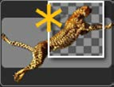
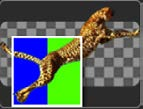
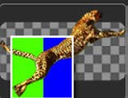

## 第十八章 Mask Tools 遮罩工具

- [Alpha Divide [ADv]](./Alpha%20Divide%20[ADv].md)
- [Alpha Multiply [AMl]](./Alpha%20Multiply%20[AMl].md)
- [Chroma Keyer [CKy]](./Chroma%20Keyer%20[CKy].md)
- [Clean Plate [CPl]](./Clean%Plate%20[CPl].md)
- [Delta Keyer [DK]](./Delta%20Keyer%20[DK].md)
- [Difference Keyer [DfK]](./Difference%20Keyer%20[DfK].md)
- [Luma Keyer [LKy]](./Luma%20Keyer%20[LKY].md)
- [Matte Control [Mat]](./Matte%20Control%20[Mat].md)
- [Primatte [Pri]](./Primatte%20[Pri].md)
  - Basic Operation Tutorial
  - Removing Spill Setup 
  - Repeatable Sampling Tools 
  - Spill Replacement Options
- [Ultra Keyer [UKy]](./Ultra%20Keyer%20[UKy].md)

<table id="img">
  <tr>
    <td rowspan="5"></td>
    <td></td>
    <td></td>
  </tr>
  <tr>
    <td></td>
    <td></td>
  </tr>
  <tr>
    <td></td>
    <td></td>
  </tr>
  <tr>
    <td></td>
    <td></td>
  </tr>
  <tr>
    <td></td>
    <td></td>
  </tr>
</table>

