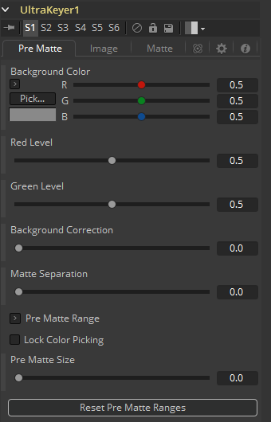
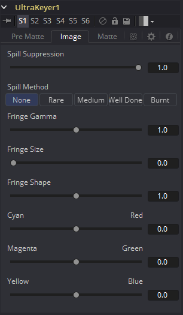
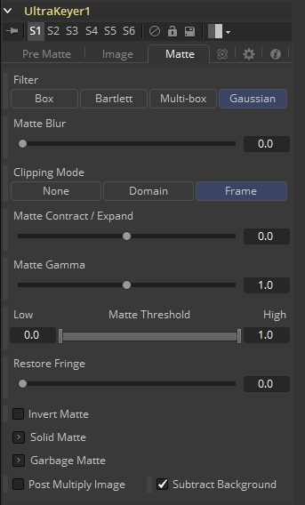

### Ultra Keyer [UKy] 超级键控

Ultra Keyer（超级键控）工具有两个内置键控器，一个“Prematte keyer（预蒙版键控器）”充当垃圾蒙版创建器和色差键控器，可以提取出精致的细节和透明度。这优化了从使用蓝屏或绿屏背景的图像中提取蒙版。

##### How to Key 如何抠像

使用“背景颜色”上的“Pick（拾取）”按钮从图像中选择蓝色或绿色的屏幕颜色。按住Option键（Alt键）同时单击并拖动拾取点，它将从上游图像中拾取颜色，并使抠像不再闪烁。

预蒙版垃圾键控器由选择屏幕颜色区域的框选触发，调整“预蒙版尺寸”将扩大垃圾蒙版，使其不修剪图像的主体。

#### Pre Matte Tab 预蒙版选项卡

##### Background Color 背景颜色

这用于选择图像的蓝屏或绿屏的颜色。最好选择离主体较近的屏幕颜色，以便与屏幕背景分离。

##### Red Level, Green Level, Blue Level 红色幅度、绿色幅度、蓝色幅度

这些调整不同通道的幅度来帮助分离颜色。当背景颜色为绿色时，提供了红色和蓝色幅度选项。当背景颜色为蓝色时，提供了红色和绿色幅度选项。

##### Background Correction 背景校正

根据上面选择的背景颜色，在进一步处理之前，键控器将在蓝色或绿色背景上迭代合并预抠像图像。

在某些情况下，这会导致更好、更细致的边缘。

##### Matte Separation 蒙版分离

蒙版分离对图像执行预处理来帮助在选择颜色之前将前景与背景分离。通常在查看Alpha时增加此控制来消除大部分的背景，但在它开始切分主体中的孔或收缩蒙版边缘的细节之前停止。

##### Pre Matte Range 预蒙版范围

这些范围控制会自动更新以表示当前的颜色选择。通常显示控制不必打开即可显示这些控制。通过在流程中选择“Ultra Keyer”工具节点并在检视器中拖动来选择用于创建蒙版色的颜色。这些范围控制可用于微调选择，但通常只需在显示中选择颜色即可。

##### Lock Color Picking 锁定颜色拾取

选中此复选框时，通过从视图中选择更多颜色，Fusion将防止所选范围的意外增长。一旦对蒙版进行了颜色选择后，最好选中此复选框。该工具中的所有其他控制都保持可编辑状态。

##### Pre Matte Size 预蒙版尺寸

“预蒙版尺寸”控制可用于柔化抠像图像周围的常规区域。这用于闭合在蒙版中的孔，通常是由溢出在半透明区域的主体。这通常也会在主体周围造成一个小光晕，可以使用工具中稍后找到的蒙版收缩工具来移除。

##### Reset Pre Matte Ranges 重置预蒙版范围

这将通过重置范围来丢弃所有颜色选择，但会保留所有其他滑块和控制值。

#### Image Tab 图像选项卡

##### Spill Suppression 溢出抑制

溢出通常是由于背景颜色通过alpha通道半透明区域传输引起的。在蓝色或绿色屏幕抠像的情况下，这通常会导致背景颜色在前景元素的须边变得明显。

溢出抑制尝试消除须边的颜色。使用的过程是针对蓝屏或绿屏进行了优化；您可以从上面的控制中选择哪种颜色作为基础颜色。

当此滑块设置为0时，不会对图像应用溢出抑制。

##### Spill Method 溢出方法

这将选择用于对图像应用溢出抑制的算法强度。

- **None**
  当不需要溢出抑制时，则选择“None”。
- **Rare**
  这几乎没有去除溢出的颜色，这是所有方法中最轻的。
- **Medium**
  这对绿屏最有效。
- **Well Done**
  这对蓝屏最有效。
- **Burnt**
  这对蓝色最有效。此模式只能用于非常麻烦的镜头。

##### Fringe Gamma 须边Gamma

此控制可用于调整抠像图像周围的须边或光晕的亮度。

##### Cyan/Red, Magenta/Green and Yellow/Blue青色/红色、品色/绿色和黄色/蓝色

使用这三个控制对图像的须边进行色彩校正。这对于校正仍包含原始背景颜色的半透明像素来匹配新背景非常有用。

##### Fringe Size 须边尺寸

这会扩大和缩小抠像图像周围的须边或光晕的大小。

##### Fringe Shape 须边形状

须边形状会强制将须边压向图像的外边缘或拉向须边的内边缘。当须边尺寸滑块的数值较大时，其效果最明显。

#### Matte Tab 蒙版选项卡

##### Matte Blur 蒙版模糊

这会使用标准的等速高斯模糊对蒙版的边缘进行模糊处理。如果值为零，则会产生一个锐利的、类似切口的硬边。值越高，应用于蒙版的模糊就越多。

##### Matte  Contract/Expand蒙版收缩/扩大

这会缩小或增大蒙版，来排除某些键控图像或包括其周围的某些区域。大于0.0的值时扩大蒙版，小于0.0的值时收缩蒙版。

##### Matte Gamma蒙版Gamma

这会提高或降低半透明区域中蒙版的值。值越高，灰色区域越不透明；值越低，灰色区域越透明。蒙版的全黑或全白区域不受影响。

##### Matte Threshold蒙版阈值

低于阈值下限的任意值在蒙版中变为黑色或透明。高于阈值上限的任意值在蒙版中变为白色或不透明。范围内的所有值都保持其相对透明度的值。

##### Invert Matte 反转蒙版

选中此复选框时，图像的alpha通道将反转，从而导致所有透明区域不透明，所有不透明区域变透明。

##### Garbage Matte 垃圾蒙版

垃圾蒙版是连接到工具节点上的“垃圾蒙版”输入的遮罩工具或图像。垃圾蒙版直接应用于图像的Alpha通道。一般来说，垃圾蒙版是用来去除不需要的但不能抠的元素，例如麦克风和吊杆。它们还用于填充包含颜色抠像但希望保留的区域。

不同模式的垃圾蒙版不能在单个工具中混合。蒙版控制工具通常用于在键控器之后添加垃圾蒙版，其效果与应用于键控器的蒙版相反。

- **Make Transparent**
  选择此按钮可使垃圾蒙版变透明。
- **Make Solid**
  选择此按钮可使垃圾蒙版变实体。

##### Post Multiply Image

选择此选项可使键控器将图像的颜色通道与为图像创建的alpha通道相乘。此选项通常已启用，默认情况下处于启用状态。

如果取消选中此复选框，则不能再将图像视为预乘图像，以将其与其他图像合并。使用合并工具的“Subtractive（减法）”选项而不是“Additive（加法）”选项。

##### Multiply Garbage Matte

选中时，图像的红色、绿色和蓝色通道的值将与垃圾蒙版输入相乘。

有关详细信息，请参阅“Merge ”合并工具文档。