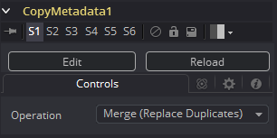
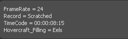

### Copy Metadata [Meta] 复制元数据

Copy Metadata结合、置换或清除你图像中的元数据。

#### Controls 控件

##### Operation 运算

下拉菜单定义了前景和背景输入的元数据该如何处理。

想象一个拥有像这样的元数据的背景图像：

而前景的元数据像这样：

##### Merge (Replace Duplicate) 合并（置换重复）

合并所有的值，但是重复名称的值将会从前景输入中获取。

输出会看起来像这样：

.png)

##### Merge (Preserve Duplicates) 合并（保留重复）

合并所有的值，但是重复名称的值将会从背景输入中获取。

输出会看起来像这样：

.png)

##### Replace 置换

背景中的整个元数据都会被前景中的所置换。

输出会看起来像这样：

##### Clear 清除

丢弃所有的元数据。