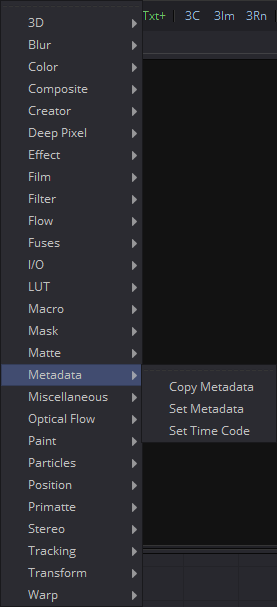
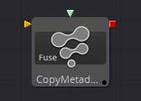
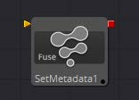
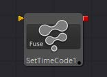

## 第二十章 Metadata Tools 元数据工具

- [Copy Metadata [Meta] 复制元数据](./Copy%20Metadata%20[Meta].md) 
- [Set Metadata [SMeta] 设置元数据](./Set%20Metadata%20[SMeta].md) 
- [Set Timecode [TCMeta] 设置时间码](./Set%20Timecode%20[TCMeta].md) 

<table id="img">
  <tr>
    <td rowspan="3"></td>
    <td></td>
  </tr>
  <tr>
    <td></td>
  </tr>
  <tr>
    <td></td>
  </tr>
</table>