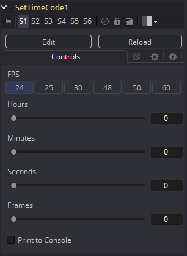

### Set Timecode [TCMeta] 设置时间码

Set Timecode基于FPS设置向元数据表中插入动态的时间码值。

#### Controls 控件



##### FPS

你可以在此处选择多种FPS设置。由于这是Fuse，所以你可以简单地通过编辑相应的代码片段来将设置适配成你所需要的：

```lua
MBTNC_StretchToFit = true,
{ MBTNC_AddButton = "24" },
{ MBTNC_AddButton = "25" },
{ MBTNC_AddButton = "30" },
{ MBTNC_AddButton = "48" },
{ MBTNC_AddButton = "50" },
{ MBTNC_AddButton = "60" },
})
```

以及这些实际值：

```lua
local rates = { 24, 25, 30, 48, 50, 60 }
```

##### Hours/Minutes/Seconds/Frames sliders 时/钟/秒/帧滑块

定义自当前合成起始帧开始的偏移。

##### Print to Console 输出至控制台

在控制台中输出详细的时间码/帧值。

时间码/帧转换通过FPS设置完成。

得到的结果看起来会像这样：

```
TimeCode:      00:00:08:15
Frames:        207
```

