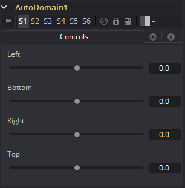

### Auto Domain [ADoD]

Auto Domain工具会根据输入图像的背景画布颜色边界自动设置图像的定义域（Domain of Definition）。它不会改变图像的物理尺寸。该工具可以通过基于内容而不是尺寸来优化图像的DoD，从而达到加速合成的效果。

例如，一个CG角色很少占用图像的整个帧。Auto Domain工具会将DoD设置为一个矩形区域，该区域覆盖了实际包含角色的场景部分。DoD在每帧上都会更新来适应变化，例如角色走近摄像机。

有关画布颜色的更多信息，另见Set Canvas Color工具。

#### Controls 控件

##### Left 左

定义ADoD搜索区域的左边界。此滑块上较高的值会将左边界向右移动，排除掉左边距中更多的数据。

1表示图像的右边界，0表示左边界。滑块默认为0（左边界）。

##### Bottom 底

定义ADoD搜索区域的底边界。此滑块上较高的值会将底边界向顶移动，排除掉底边距中更多的数据。

1表示图像的顶边界，0表示底边界。滑块默认为0（底边界）。

##### Right 右

定义ADoD搜索区域的右边界。此滑块上较高的值会将右边界向左移动，排除掉右边距中更多的数据。

1表示图像的左边界，0表示右边界。滑块默认为0（右边界）。

##### Top 顶

定义ADoD搜索区域的顶边界。此滑块上较高的值会将顶边界向底移动，排除掉顶边距中更多的数据。

1表示图像的底边界，0表示顶边界。滑块默认为0（顶边界）。

