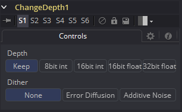

### Change Depth [CD] 更改深度

Change Depth工具有一个简单的用途：更改用于处理工具的每个色彩通道的位数。该工具的单个控件是Depth（深度），其中包含五个按钮。选择Keep（保持）以保持原先的色彩深度，或者选择8位、16位或浮点更改为所选色深。

该工具总是用于Cineon文件的色彩矫正后，将浮点处理转换为每通道16位来保留内存和性能。

如果从流程中的某一特定的点开始，你觉得有必要在比原先更高的位深来处理图像或是减少位深来节省内存，它都是非常有用的。

#### Controls 控件

##### Depth 深度

Keep（保持）不会对图像做任何事，而仅仅时保持输入的深度。其他的选项会更改图像的深度为相应的值。

##### Dither 颤动

从较高的位深度向下转换时，将Error Diffusion（错误散射）或Additive Noise（加性噪声）添加到由有问题的（高对比度）区域导致的伪像中可能会有帮助。