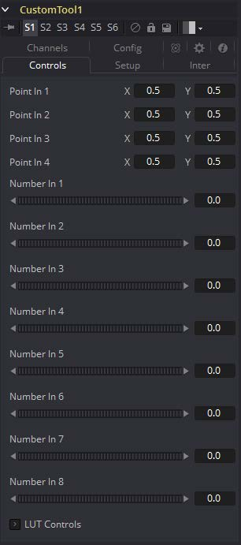
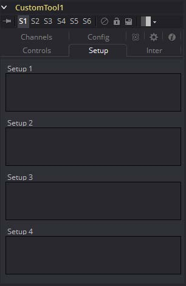
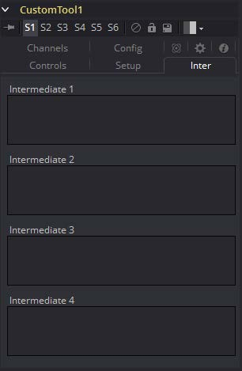
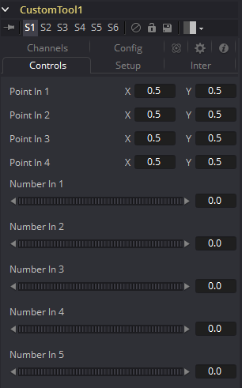
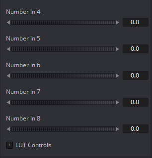
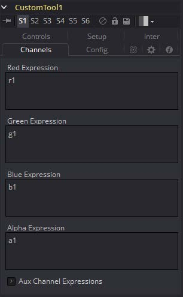

### Custom Tool [CT] 自定义工具

Custom工具很有可能是Fusion中最复杂且强大的工具。任何对脚本或C++编程有一定经验的用户都应该能在Custom工具中找到类似的结构和术语。

Custom工具用于创建自定义的表达式和滤镜来修改图片。除了提供三个图像输入外，Custom工具还允许最多连接8个数字输入和来自流程中别的控件和参数的多达4个XY位置值。

预像素计算可以表现在图像的Red、Green、Blue、Alpha、Z、Z Coverage、UV材质坐标、XYZ Normals、RGBA背景颜色和XY运动向量通道。

#### Controls 控件

##### Point In 1-4, X and Y 点输入1-4，X和Y

这四个控件是2D的X和Y中心控件，可作为变量`p1x`、`p1y`、...、`p4x`、`p4y`用于在Setup、Intermediate和Channels选项卡中输入的表达式。它们是正常的位置控件，可以像其他任何工具一样添加动画或连接到修改器。

##### Number In 1-8 数值输入1-6

这些控件的值可作为变量`n1`、`n2`、`n3`、...、`n8`用于在Setup、Intermediate和Channels选项卡中输入的表达式。它们是普通的滑块控件，可以像其他任何工具一样添加动画或连接到修改器。

##### LUT In 1-4 LUT输入1-4

Custom工具提供了4个LUT样条。这些控件的值可用于在Setup、Intermediate和Channels选项卡中输入的使用了`getlut#`函数的表达式。例如，将R，G，B和A表达式分别设置为`getlut1(r1)`、`getlut2(g1)`、`getlut3(b1)`和`getlut4(a)`会导致Custom工具模仿Color Curves工具。

这些工具可以使用Config选项卡中的选项重命名，来让它们的含义更加明显，但表达式仍将它们的值视为`n1`、`n2`、...、`n8`。

#### Setup Tab 设置选项卡

##### Setup 1-4 设置1-4

在Custom工具的Setup选项卡中，最多可以计算四个单独的表达式。在执行任何其他计算之前，每帧对设置表达式进行一次核算。然后将结果作为变量`s1`、`s2`、`s3`和`s4`提供给Custom工具中的其他表达式。

> **注意：**因为这些表达式仅每帧一次而不是每个像素一次，所以使用像X和Y这样的每个像素变量或像`r1`、`g1`、`b1`这样的通道变量都没有意义。允许的值包括常量、像`n1`...`n8`、`time`、W和H等这样的变量，以及类似于`sin()`或`getr1d()`的函数。

#### Inter Tab 中间选项卡

##### Intermediate 1-4 中间1-4

可以在Inter选项卡中计算另外四个表达式。在核算Setup表达式之后但在核算Channels表达式之前，每个像素对Inter表达式进行一次核算。允许使用每个像素的通道变量，例如`r1`、`g1`、`b1`和`a1`。结果可用作变量`i1`、`i2`、`i3`和`i4`。

#### Config Tab 配置选项卡

##### Random Seed 随机种子

使用它来设置`rand()`和`rands()`函数的种子。单击Randomize按钮将种子设置为随机值。如果需要多个拥有各自不同的随机结果Custom工具，则可能需要此控件。

##### Number Controls 数值控件

共有八组Number控件，与Controls选项卡中的八个Number In滑块相对应。取消选中Show Point复选框来隐藏相应的Number In滑块，或编辑Number文本字段的Name以更改其名称。

##### Point Controls 点控件

有四组Point控件，与Controls选项卡中的四个Point In控件相对应。取消选中Show Point复选框，来在查看器中隐藏相应的Point In控件及其十字线。同样，编辑Point文本字段的Name以更改其名称。

#### Channels Tab 通道选项卡

##### RGBA, Z, UV Expressions and XYZ Normal Expressions RGBA、Z、UV表达式和XYZ Normal表达式

Channel选项卡用于为图像的每个可用通道设置一个表达式。每个表达式每个像素核算一次，结果用于在图像输出中创建该像素的值。

色彩通道表达式（RGBA）通常应返回0.0到1.0之间的浮点值。如果目标图像是整型，则超出此范围的值将被裁剪。其他表达式字段应产生适合其通道的值（例如，Vector和Normal字段的值介于-1.0和1.0之间，Coverage的值介于0.0到1.0之间，而Depth则可以是任意值）。Channel表达式可以使用Setup表达式（作为变量`s1`-`s4`）和Inter表达式（作为变量`i1`-`i4`）的结果。

#### Syntax 语法

##### Value Variables 值变量

| 名称                   | 描述                                 |
| ---------------------- | ------------------------------------ |
| `n1`..`n8`             | 数值输入                             |
| `p1x`..`p4x`           | 位置值（X轴）                        |
| `p1y`..`p4y`           | 位置值（Y轴）                        |
| `s1`..`s4`             | Setup表达式结果                      |
| `i1`..`i4`             | Inter表达式结果                      |
| `time`                 | 当前帧                               |
| `x`                    | 当前像素的水平坐标，在0.0到1.0之间   |
| `y`                    | 当前像素的垂直坐标，在0.0到1.0之间   |
| `w`（或`w1`..`w3`）    | 图像的宽度（对于`image1`..`image3`） |
| `h`（或`h1`..`h3`）    | 图像的高度（对于`image1`..`image3`） |
| `ax`（或`ax1`..`ax3`） | 图像X比例（对于`image1`..`image3`）  |
| `ay`（或`ay1`..`ay3`） | 图像Y比例（对于`image1`..`image3`）  |

> **注意：**使用不接数字的`w`和`h`以及`ax`和`ay`来得到基础图像的尺寸和尺寸。

##### Channel (Pixel) Variables 通道（像素）变量

| 名称           | 描述                                 |
| -------------- | ------------------------------------ |
| `c1`..`c3`     | 当前通道（对于`image1`..`image3`）   |
| `r1`..`r3`     | Red（对于`image1`..`image3`）        |
| `g1`..`g3`     | Green（对于`image1`..`image3`）      |
| `b1`..`b3`     | Blue（对于`image1`..`image3`）       |
| `a1`..`a3`     | Alpha（对于`image1`..`image3`）      |
| `z1`..`z3`     | Z缓冲区（对于`image1`..`image3`）    |
| `cv1`..`cv3`   | Z Coverage（对于`image1`..`image3`） |
| `u1`..`u3`     | U坐标（对于`image1`..`image3`）      |
| `v1`..`v3`     | V坐标（对于`image1`..`image3`）      |
| `nx1`..`nx3`   | X Normal（对于`image1`..`image3`）   |
| `ny1`..`ny3`   | Y Normal（对于`image1`..`image3`）   |
| `nz1`..`nz3`   | Z Normal（对于`image1`..`image3`）   |
| `bgr1`..`bgr3` | 背景Red（对于`image1`..`image3`）    |
| `bgg1`..`bgg3` | 背景Green（对于`image1`..`image3`）  |
| `bgb1`..`bgb3` | 背景Blue（对于`image1`..`image3`）   |
| `bga1`..`bga3` | 背景Alpha（对于`image1`..`image3`）  |
| `vx1`..`vx3`   | X Vector（对于`image1`..`image3`）   |
| `vy1`..`vy3`   | Y Vector（对于`image1`..`image3`）   |

> **注意：**使用`c1`、`c2`、`c3`来引用当前通道中的像素值。这使复制/粘贴表达式更加容易。例如，如果将`c1/2`键入为Red表达式，则结果将是`image1`中Red像素值的一半，但是如果将表达式复制到Blue通道中，现在它将具有来自Blue通道的像素值。

要引用输入1中当前像素的红色值，键入`r1`。而对于输入2中的图像，它将为`r2`。

- **get\[ch][#]b(x, y)** 读取`x, y`处的像素，如果超出范围则读取0，如`getr1b(0,0)`
- **get\[ch][#]d(x, y)** 读取`x, y`处的像素，如果超出范围则读取边缘处的，如`getr1d(0,0)`
- **get\[ch][#]w(x, y)** 读取`x, y`处的像素，如果超出范围则读取环绕处的，如`getr1w(0,0)`

> **注意：**有多种方法可用来引用图像中当前位置以外的其他位置的像素。

在上面的描述中，`[ch]`是代表要访问通道的字母，`[#]`是代表输入图像的数字。 因此，要获取当前像素的红色分量（相当于‘r’），可以使用`getr1b(x, y)`。要获得`image2`中心像素的alpha分量，可以使用`geta2b(0.5, 0.5)`。

- **getr1b(x,y)** 如果x，y处存在有效像素，则输出此处像素的红色值。如果位置超出图像边界（所有通道），它将输出0.0。
- **getr1d(x,y)** 如果x，y处存在有效像素，则输出此处像素的红色值。如果位置超出图像边界（仅RGBA），结果将为边缘处的像素。
- **getr1w(x,y)** 如果x，y处存在有效像素，则输出此处像素的红色值。如果位置超出图像边界（仅RGBA），x和y坐标将会环绕至图像的另一侧直至那一处。

要使用这些函数访问其他通道值，请使用正确的通道变量（`r`、`g`、`b`、`a`和仅对于`getr1b()`函数的`z`等）替换上述示例中的`r`，如上所示。在上面的示例中，将1替换为2或3可以从其他图像输入访问图像。

##### Mathematical Expressions 数学表达式

| 名称                             | 描述                                   |
| -------------------------------- | -------------------------------------- |
| `pi`                             | pi的值                                 |
| `e`                              | e的值                                  |
| `log(x)`                         | 10为底`x`的对数                        |
| `ln(x)`                          | `x`的自然对数（e为底）                 |
| `sin(x)`                         | `x`的正弦（`x`为度数）                 |
| `cos(x)`                         | `x`的余弦（x为度数）                   |
| `tan(x)`                         | `x`的正切（x为度数）                   |
| `asin(x)`                        | `x`的反正弦，以度数为单位              |
| `acos(x)`                        | `x`的反余弦，以度数为单位              |
| `atan(x)`                        | `x`的反正切，以度数为单位              |
| `atan2(x, y)`                    | `x, y`的反正切，以度数为单位           |
| `abs(x)`                         | `x`的绝对值                            |
| `int(x)`                         | `x`的整数（整部）值                    |
| `frac(x)`                        | `x`的小数值                            |
| `sqrt(x)`                        | `x`的平方根                            |
| `rand(x, y)`                     | `x`和`y`之间的随机值                   |
| `rands(x, y, s)`                 | `x`和`y`之间的随机值，基于种子s        |
| `min(x, y)`                      | `x`和`y`之间的最小值（低值）           |
| `max(x, y)`                      | `x`和`y`之间的最大值（高值）           |
| `dist(x1, y1, x2, y2)`           | 点`x1, y1`和`x2, y2`之间的距离         |
| `dist3d(x1, y1, z1, x2, y2, z3)` | 点`x1, y1, z1`和`x2, y2, z2`之间的距离 |
| `noise(x)`                       | 基于`x`的缓慢变化的Perlin噪声          |
| `noise2(x, y)`                   | 基于`x`和`y`缓慢变化的Perlin噪声       |
| `noise3(x, y, z)`                | 基于`x`、`y`和`z`缓慢变化的Perlin噪声  |
| `if(c, x, y)`                    | 若`c`为0返回`x`，否则`y`               |

##### Mathematical Operators 数学运算符

| 运算符 | 描述                                                    |
| ------ | ------------------------------------------------------- |
| `!x`   | 若x=0则为1.0，否则为0.0                                 |
| `-x`   | (0.0-x)                                                 |
| `+x`   | (0.0+x)，即实际上什么都没做                             |
| `x^y`  | x的y次幂                                                |
| `x*y`  | x乘以y                                                  |
| `x/y`  | x除以y                                                  |
| `x%y`  | x模除以y，即x除以y的余数                                |
| `x+y`  | x加上y                                                  |
| `x-y`  | x减去y                                                  |
| `x<y`  | 若x小于y则为1.0，否则为0.0                              |
| `x>y`  | 若x大于y则为1.0，否则为0.0                              |
| `x<=y` | 若小于等于y则为1.0，否则为0.0                           |
| `x>=y` | 若x大于等于y则为1.0，否则为0.0                          |
| `x=y`  | 若x恰等于y则为1.0，否则为0.0                            |
| `x==y` | 若x恰等于y则为1.0，否则为0.0， 与上面完全相同           |
| `x<>y` | 若x不等于y则为1.0，否则为0.0                            |
| `x!=y` | 若x不等于y则为1.0，否则为0.0，与上面完全相同            |
| `x&y`  | 若x和y都不为0.0则为1.0，否则为0.0                       |
| `x&&y` | 若x和y都不为0.0则为1.0，否则为0.0，与上面完全相同       |
| `x|y`  | 若x或y（或都）不为0.0则为1.0，否则为0.0                 |
| `x||y` | 若x或y（或都）不为0.0则为1.0，否则为0.0，与上面完全相同 |

#### Example 示例

下列几个示例用于帮助你理解Custom工具的各个组件。

##### Rotate 旋转

要旋转一个图像，我们需要2D旋转的标准等式：

`x’ = x * cos(theta) - y * sin(theta)` 
`y’ = x * sin(theta) + y * cos(theta)`

使用`n1`滑块获取角度`theta`和样本函数，我们可以得到（对于红色通道）：

`getr1b(x * cos(n1) - y * sin(n1), x * sin(n1) + y * cos(n1))`

这将计算围绕`(0, 0)`（左下角）的原点旋转的当前像素的`(x, y)`位置，然后从该旋转位置的源像素获取红色分量。对于中心旋转，我们需要在旋转x和y坐标之前将其减去0.5，然后再加上0.5：

`getr1b((x-.5) * cos(n1) - (y-.5) * sin(n1) + .5, (x-.5) * sin(n1) + (y-.5) * cos(n1) + .5)`

这将我们带入了下一课：Setup和Intermediate表达式。这些通过最小化通道表达式中完成的工作来加快处理速度。Setup表达式仅执行一次，其结果对于任何像素均不变，因此您可以分别将它们用于`s1`和`s2`：

`cos(n1)`
`sin(n1)`

Intermediate表达式对每个像素执行一次，因此您可以将它们用于`i1`和`i2`：

`(x-.5) * s1 - (y-.5) * s2 + .5 `
`(x-.5) * s2 + (y-.5) * s1 + .5`

这些是`getr1b()`函数的`x`和`y`参数，与上面的相同，但使用Setup结果`s1`和`s2`替换，以便触发函数每帧仅执行一次，而不是每个像素执行一次。现在，您可以在Channels表达式中使用以下中间结果：

`getr1b(i1, i2)`
`getg1b(i1, i2)`
`getb1b(i1, i2)`
`geta1b(i1, i2)`

使用Intermediate表达式替换后，我们只需要对每个像素进行一次所有的加、减和乘运算，而不是每个像素四次。根据经验，如果不变，则只需执行一次。

这只是一个简单的旋转，完全没有考虑图片的宽高比。这将作为练习留给读者包括（抱歉）。另一个改进可能是允许围绕中心以外的其他点旋转。

##### Filtering 滤镜

我们的第二个示例复制了3x3Custom Filter工具集的功能，该工具集可对当前像素及其周围的八个像素取平均。要使用Custom工具复制它，请将Custom工具添加到流程中，然后在Setup选项卡中输入以下表达式。

（在准备就绪之前，请断开工具的连接，以防止其更新。）

`S1`
`1.0/w1`
`S2`
`1.0/h1`

这两个表达式将在每个帧的开始进行核算。`S1`将帧的当前宽度除以1.0，`S2`将高度除以1.0。这提供了介于`0.0`和`1.0`之间的浮点值，该值表示沿每个轴从当前像素到下一个像素的距离。

现在，在Channels选项卡（r）的第一个文本控件中输入以下表达式：

`(getr1w(x-s1, y-s2) + getr1w(x, y-s2) + getr1w(x+s1, y-s2) + getr1w(x+s1, y) + getr1w(x-s1, y) + r1 + getr1w(x-s1, y+s2) + getr1w(x, y+s2) + getr1w(x+s1, y+s2)) / 9`

该表达式通过调用`getr1w()`函数9次并为其提供相对于当前位置的值，将当前像素上方的9个像素相加。注意，我们通过使用`x+s1`、`y+s2`而不是使用`x+1`、`y+1`来引用像素。

Fusion将像素表示为介于0.0到1.0之间的浮点值，这就是为什么我们创建了在Setup选项卡中使用的表达式的原因。如果我们改用`x+1`、`y+1`，则该表达式将一遍又一遍地采样完全相同的像素。（如果偏移值超出范围，我们使用的函数将像素位置环绕在图像周围。）

那样考虑到了Red通道。现在对Green、Blue和Alpha通道使用以下表达式：

`(getg1w(x-s1, y-s2) + getg1w(x, y-s2) + getg1w(x+s1, y-s2) + getg1w(x+s1, y) + getg1w(x-s1, y) + g1 + getg1w(x-s1, y+s2) + getg1w(x, y+s2) + getg1w(x+s1, y+s2)) / 9`

`(getb1w(x-s1, y-s2) + getb1w(x, y-s2) + getb1w(x+s1, y-s2) + getb1w(x+s1, y) + getb1w(x-s1, y) + b1 + getb1w(x-s1, y+s2) + getb1w(x, y+s2) + getb1w(x+s1, y+s2)) / 9`

`(geta1w(x-s1, y-s2) + geta1w(x, y-s2) + geta1w(x+s1, y-s2) + geta1w(x+s1, y) + geta1w(x-s1, y) + a1 + geta1w(x-s1, y+s2) + geta1w(x, y+s2) + geta1w(x+s1, y+s2)) / 9`

是时候查看结果了。添加Background工具并设置为纯色，然后将颜色更改为纯红色。添加一个硬边矩形效果遮罩并将其连接到刚创建的表达式。

为了进行比较，添加一个Custom Filter工具并复制上面图形中的设置。将管道连接到该工具，从后台将其连接到该工具并查看结果。在放大到效果遮罩的顶角附近时，在查看Custom工具和Custom Filter之间切换。

当然，Custom Filter工具的渲染速度比我们创建的Custom工具快得多，但是Custom工具的灵活性是其主要优势。例如，您可以使用连接到输入2的图像，通过将表达式中的`getr1w`、`getg1w`和`getb1w`的所有实例更改为`getr2w`、`getg2w`和`getb2w`来控制应用于输入1的中位数，但保留`r1`、`g1`和`b1`保持原样。

这只是一个示例。自定义工具的可能性是无限的。