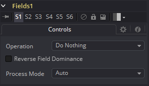
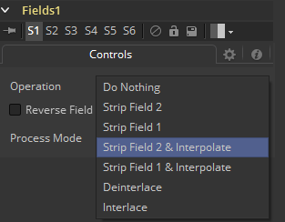
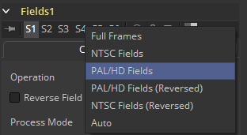

### Field [Fld] 区域

Field工具是一个健壮的多功能实用工具，提供了多个有关隔行视频帧的功能。它将分离的视频场插入视频帧，或将视频帧分离为独立的视频场。

有关更多Fusion如何进行场处理的信息，查阅本手册的帧格式（Frame Formats）一章。

#### Controls 控件

##### Operation 运算

该控件用于选择该工具将表现出的运算类型。见下方的详细解释。

##### Process Mode 处理模式

该控件用于选择用于输出图像的场格式。见下方的详细解释。

#### Operation 运算

##### Do Nothing 什么都不做

这会使图像只受到Process Mode选择的影响。

##### Strip Field 2 剥除场2

这会从输入图像流中移除场2，这也会使图像缩短为原先一半的高度。

##### Strip Field 1 剥除场1

这会从输入图像流中移除场1，这也会使图像缩短为原先一半的高度。

##### Strip Field 2 and Interpolate 剥除场2并隔行

这会从输入图像流中移除场2并从插入来自场1的插值场来保持原先的图像高度。这应该提供帧，而不是场。

##### Strip Field 1 and Interpolate 剥除场1并隔行

这会从输入图像流中移除场1并从插入来自场2的插值场来保持原先的图像高度。这应该提供帧，而不是场。

##### Interlace 隔行

这结合了来自输入图像流的场。如果提供了一个图像流，那么每一对帧都会结合形成一半量的两倍高度帧。如果提供了两个图像流，那么来自每个流的单帧都会结合形成两倍高度的图像。

##### De-Interlace 去隔行

这会从一个输入图像流中分离场，这会产生两份量的一半高度的帧。

##### Reverse Field Dominance 反转场控制

选中后，图像的场顺序（Field order）或控制（Dominance）会被交换。

#### Process 处理

##### Full Frames 整个帧

这会强制帧处理，有助于处理流程中的一部分会进行场处理的帧。

##### NTSC Fields NTSC场

这会强制NTSC场处理，有助于处理流程中的一部分会进行场处理的帧。

##### PAL Fields PAL场

这会强制PAL场处理，有助于处理流程中的一部分会进行场处理的帧。

##### PAL Fields(Reversed) PAL场（反转）

这会强制PAL交换场处理。

##### NTSC Fields(Reversed) NTSC场（反转）

这回强制NTSC交换场处理。

##### Auto 自动

这回尝试匹配输入图像的模式，如果输入类型是混合的，那么将使用场。