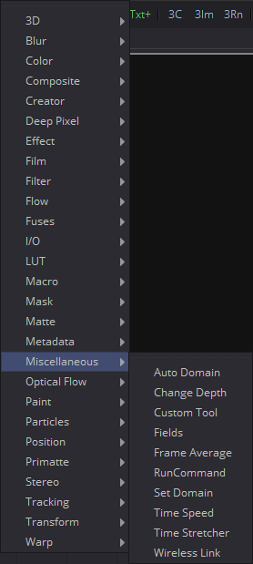
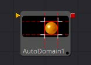
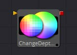
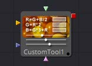
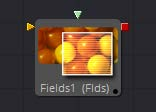

## 第二十一章 Miscellaneous Tools 杂项工具

- [Auto Domain [ADoD] 自动定义域](./Auto%20Domain%20[ADoD].md) 
- [Change Depth [CD] 更改深度](./Change%20Depth%20[CD].md) 
- [Custom Tool [CT] 自定义工具](./Custom%20Tool%20[CT].md) 
- [Field [Fld] 区域](./Field%20[Fld].md) 
- [Run Command [Run] 运行指令](./Run%20Command%20[Run].md) 
- [Set Domain [DoD] 设置定义域](./Set%20Domain%20[DoD].md) 
- [Time Speed [TSp] 时间速度](./Time%20Speed%20[TSp].md) 
- [Time Stretcher [TSt] 时间伸缩器](./Time%20Stretcher%20[TSt].md) 

<table id="img">
  <tr>
	<td rowspan="4"></td>
    <td></td>
    <td></td>
  </tr>
  <tr>
    <td></td>
    <td></td>
  </tr>
  <tr>
    <td></td>
    <td></td>
  </tr>
  <tr>
    <td></td>
    <td></td>
  </tr>
</table>
