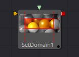
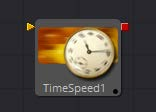

## 第二十一章 Miscellaneous Tools 杂项工具

- [Auto Domain [ADoD]](./Auto%20Domain%20[ADoD].md) 
- [Change Depth [CD]](./Change%20Depth%20[CD].md) 
- [Custom [Cu]](./Custom%20[Cu].md) 
- [Field [Fld]](./Field%20[Fld].md) 
- [Run Command [Run]](./Run%20Command%20[Run].md) 
- [Set Domain [DoD]](./Set%20Domain%20[DoD].md) 
- [Time Speed [TSp]](./Time%20Speed%20[TSp].md) 
- [Time Stretcher [TSt]](./Time%20Stretcher%20[TSt].md) 

<table id="img">
  <tr>
	<td rowspan="4"></td>
    <td></td>
    <td></td>
  </tr>
  <tr>
    <td></td>
    <td></td>
  </tr>
  <tr>
    <td></td>
    <td></td>
  </tr>
  <tr>
    <td></td>
    <td></td>
  </tr>
</table>