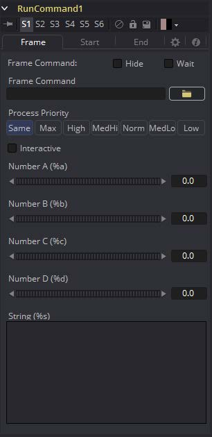
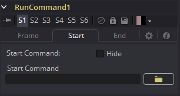
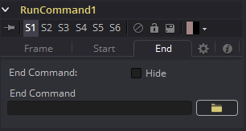

### Run Command [Run] 运行指令

RunCommand工具用于在渲染的某一特定时刻执行外部命令或批处理文件。可以选择在渲染的开始或结束运行命令，或者在每一帧执行命令。

图像输入并不是该工具运算所必需的，不过如果RunCommand连接上了一个工具的输出，那么命令只会在那一工具解释渲染时启动。在连接到Saver时，这通常用来确保输出帧先被完全地保存到了次哦按中。如果启动的程序返回了非0结果，那么该工具将会失败。

RunCommand也可以用于网络渲染使用Fusion渲染管理器的其他命令行程序以及许多其他有用的功能。

#### Controls 控件

##### Frame Command 帧命令

该工具中的第一个文件浏览器是用于指定要在每帧渲染结束后运行的命令的路径和参数。选中Hide复选框来防止程序或脚本在执行是显示窗口。

##### Hide 隐藏

选中该复选框来抑制由命令启动的任何窗口或对话框的显示。

##### Wait 等待

启用该复选框来使工具在继续之前等待远程程序或工具退出。如果清除了复选框，那么该工具将会继续渲染而不会等待外部程序。

##### Number A (%a) And Number B (%b) 数值A（%a）和数值B（%b）

帧命令可以使用使用多种通配符；这些通配符将会在渲染时替换成正确的值。

- **%a：**输出Number A指轮控件的数值。
- **%b：**输出Number B指轮控件的数值。
- **%t：**输出当前的帧编号（不含0填充）
- **%s：**使用大的文本输入字段中的文本替换。

如果你想要为%t产生的数值添加零填充，参考通配符%0x，其中x是要填充值的位数。这对于%a和%b同样有用。

举个例子，test%04t.tga会在渲染时返回下列值：

`test0000.tga`
`test0001.tga`
`test0009.tga`
`test0010.tga`

你同样也可以调用%x来使用空格填充，其中x时你想要填充的空格数。

##### Process Priority 进程优先级

Process Priority按钮提供了选择运行的进程启动时的优先级的选项。这确定了相对于其他应用程序，启动的进程拥有多少处理器时间。

##### Interactive 交互

该复选框确定了启动的应用程序是否应该以交互式运行，允许yoghurt输入。

#### Start and End Tabs 启动和结束选项卡

Start和End选项卡包含了用于在合成开始和结束渲染时运行脚本一个文件浏览器

#### Example 示例

若要在渲染每一帧时将保存的文件从渲染复制到另一个目录，将以下文本保存在名为copyfile.bat的文件中，并保存到C:\目录（根文件夹）中。

`@echo off`
`set parm=%1 %2`
`copy %1 %2`
`set parm=`

创建或加载任何包含Saver的流程。接下来的示例假定Saver设置了输出为D:/test0000.tga、test0001.tga等等。你也可以修改示例来使之匹配。

在Saver后添加一个RunCommand工具来确保Saver先被渲染完，现在项RunCommand工具的帧控件文本框中输入。

C:\copytest.bat :D\test%04f.tga C\

选中Hide Frame命令复选框来防止命令提示符在每一帧结束后都弹出。

当流程渲染结束后，每个文件都会瞬间被拷贝到C:\路径下。

RunCommand工具可用于将文件通过FTP传输到网络上的远程驱动器或Abekas设备，在渲染时打印出每个帧或执行自定义图像处理工具。

RunCommand工具不限于执行简单的批处理文件。仅举几个例子，也可以使用FusionScript、VBScript、Jscript、CGI和Perl文件。